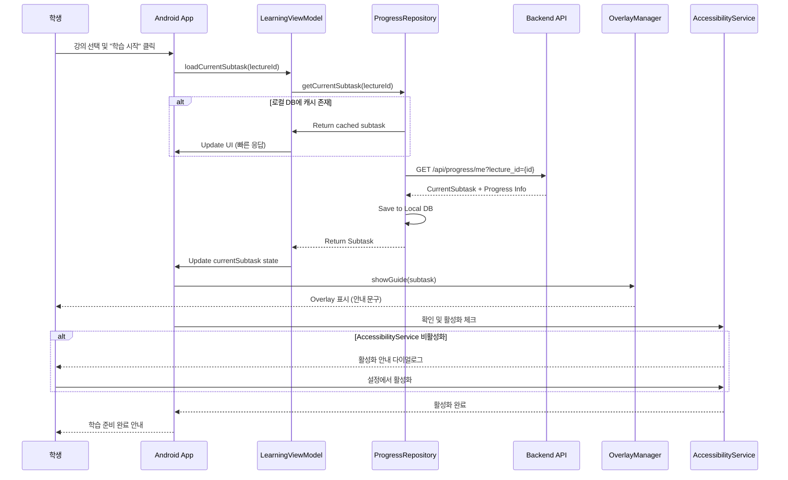
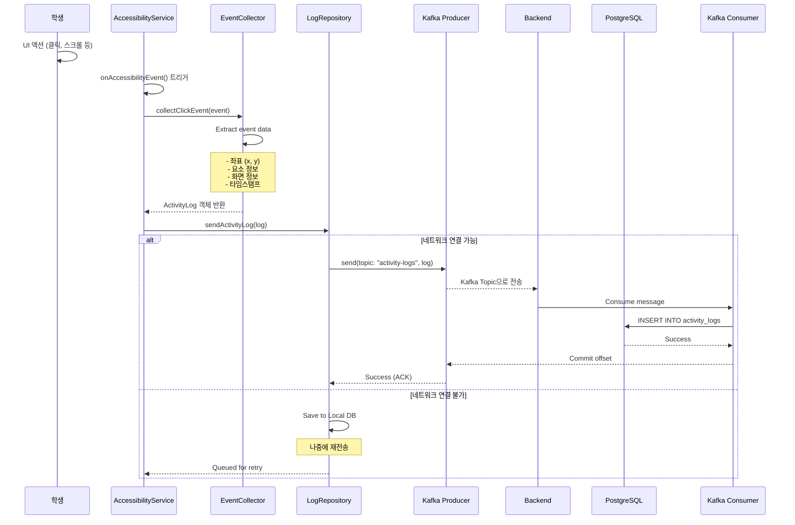
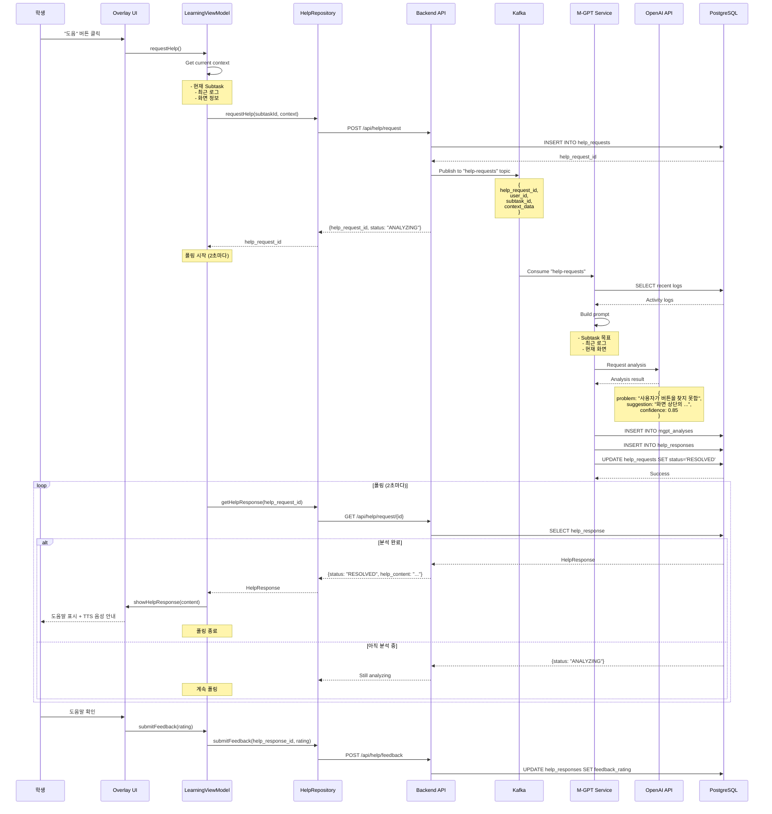
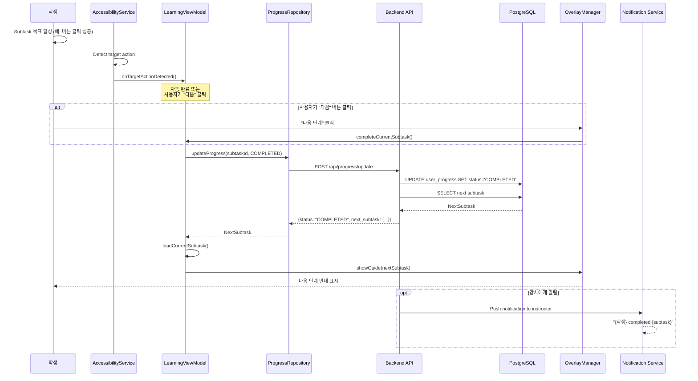
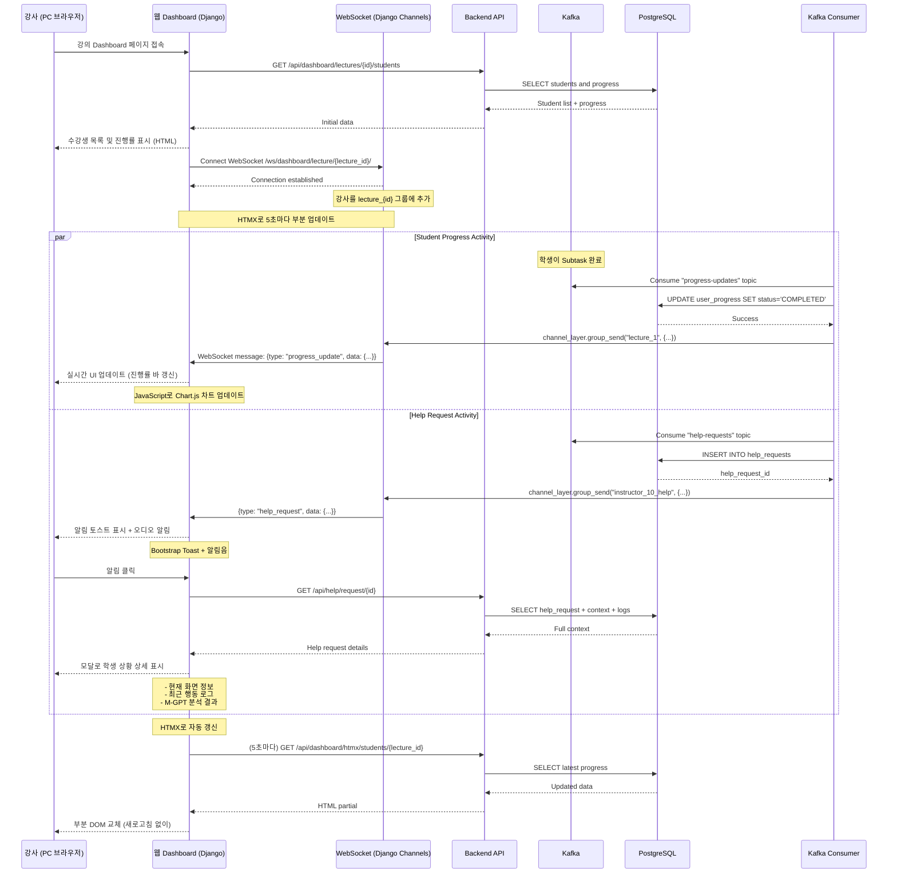
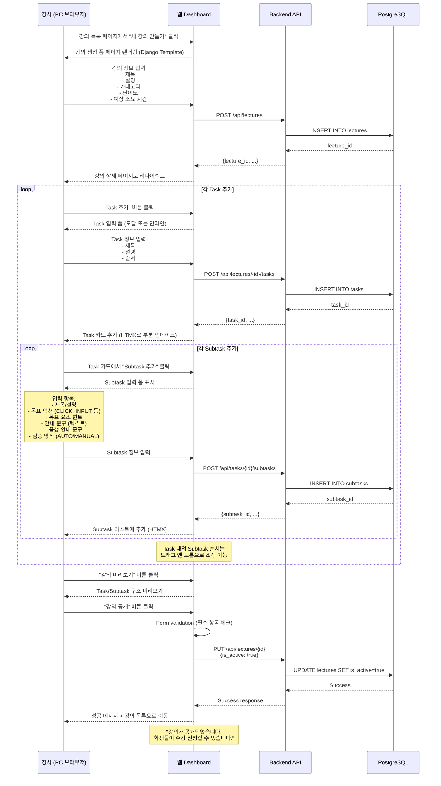
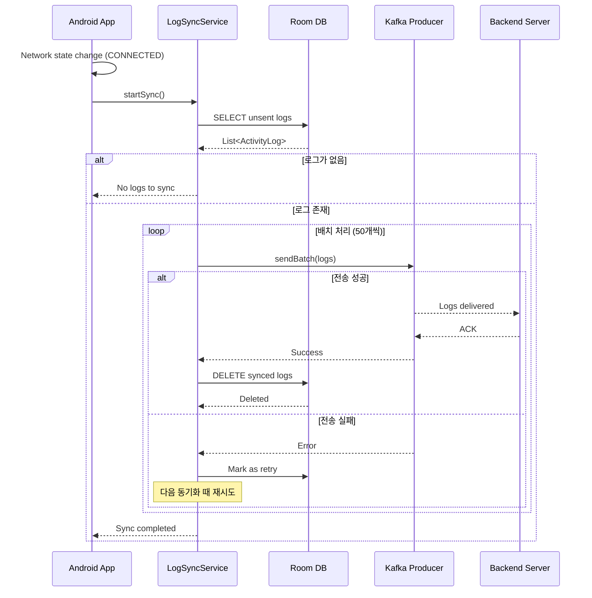
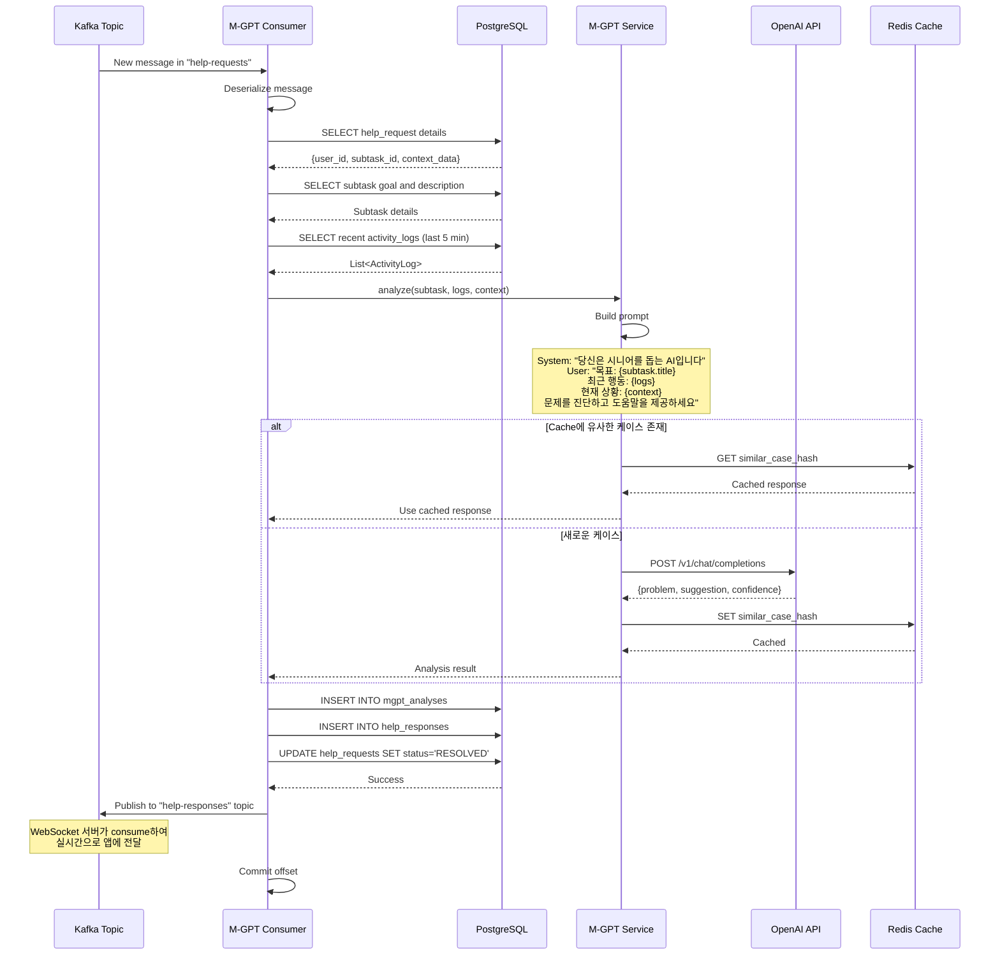

# 핵심 플로우 시퀀스 다이어그램

## 1. 학습 시작 플로우

사용자가 강의를 선택하고 학습을 시작하는 과정

---

## 2. 로그 수집 및 Kafka 전송 플로우

사용자의 UI 이벤트를 감지하고 서버로 전송하는 과정

---

## 3. 도움 요청 및 M-GPT 분석 플로우

사용자가 도움을 요청하고 AI 분석 결과를 받는 과정

---

## 4. 진행 상태 업데이트 플로우

사용자가 Subtask를 완료하는 과정

---

## 5. 강사 웹 Dashboard 실시간 모니터링 플로우

강사가 PC 웹 브라우저에서 수강생의 진행 상태를 실시간으로 확인하는 과정

---

## 6. 강의 생성 플로우 (강사용 - 웹 Dashboard)

강사가 PC 웹에서 새로운 강의를 생성하고 Task/Subtask를 등록하는 과정

---

## 7. 배치 로그 동기화 플로우

네트워크가 끊겼다가 복구된 후 로컬 DB의 로그를 서버로 전송

---

## 8. M-GPT 분석 파이프라인 (Backend)

Kafka Consumer가 도움 요청을 받아 M-GPT로 분석하는 과정

---

## 플로우 요약

1. **학습 시작**: 강의 선택 → 현재 Subtask 로드 → Overlay 표시 → AccessibilityService 활성화
2. **로그 수집**: UI 이벤트 감지 → Kafka 전송 → DB 저장 (실패 시 로컬 저장 후 재전송)
3. **도움 요청**: 버튼 클릭 → API 요청 → Kafka → M-GPT 분석 → 응답 폴링 → Overlay 표시
4. **진행 업데이트**: Subtask 완료 → API 업데이트 → 다음 Subtask 로드 → Overlay 갱신
5. **강사 모니터링**: WebSocket 연결 → 실시간 업데이트 수신 → Dashboard 갱신
6. **강의 생성**: 강의 생성 → Task 추가 → Subtask 추가 → 공개
7. **배치 동기화**: 네트워크 복구 → 로컬 DB 조회 → 배치 전송 → 삭제
8. **M-GPT 파이프라인**: Kafka consume → 로그 조회 → OpenAI 분석 → 결과 저장 → 응답 전달

---

이 시퀀스 다이어그램들은 Mermaid로 렌더링할 수 있으며, 각 플로우의 흐름을 명확히 보여줍니다.
