# Android 학생 앱 화면 흐름도

MobileGPT Android 학생 앱의 화면 구조, 사용자 플로우, 주요 기능을 정의하는 문서입니다.

## 목차
1. [개요](#개요)
2. [화면 구조](#화면-구조)
3. [사용자 플로우](#사용자-플로우)
4. [화면별 상세 설명](#화면별-상세-설명)
5. [WebSocket 통신 흐름](#websocket-통신-흐름)
6. [AccessibilityService 동작](#accessibilityservice-동작)
7. [에러 처리](#에러-처리)

---

## 개요

### 앱 정보
- **대상 사용자**: 60대 이상 시니어 학습자
- **플랫폼**: Android (최소 API 30, Android 11.0 이상)
- **기술 스택**: Kotlin, Jetpack Compose, Material Design 3
- **아키텍처**: MVVM + Clean Architecture

### 주요 기능
1. JWT 기반 로그인
2. 세션 코드로 강의 참가
3. WebSocket 실시간 통신
4. UI 이벤트 자동 수집 (AccessibilityService)
5. 단계별 학습 진행

---

## 화면 구조

### 화면 목록

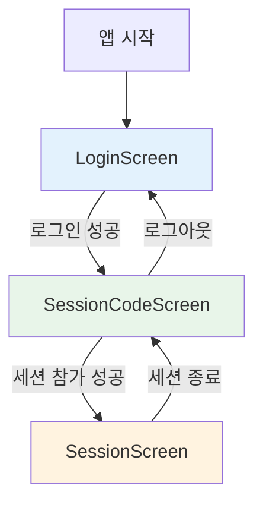

### 내비게이션 구조

| 화면 | Route | 설명 |
|------|-------|------|
| LoginScreen | `/login` | 초기 로그인 화면 |
| SessionCodeScreen | `/session-code` | 세션 코드 입력 화면 |
| SessionScreen | `/session/{sessionId}` | 세션 진행 화면 |

---

## 사용자 플로우

### 전체 사용자 여정

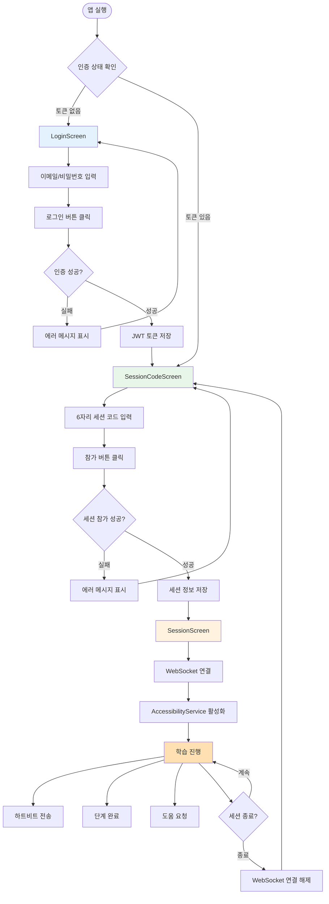

---

## 화면별 상세 설명

### 1. LoginScreen (로그인 화면)

#### 목적
- 학생 인증 및 JWT 토큰 획득
- 최초 1회 로그인 후 토큰 저장

#### UI 구성

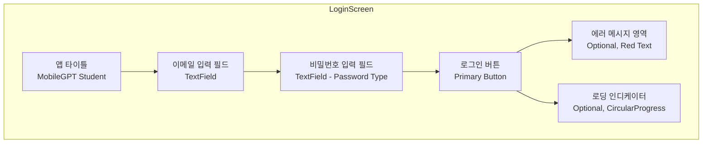

#### 필드 정보

| 요소 | 타입 | 검증 규칙 | 기본값 |
|------|------|-----------|--------|
| 이메일 | TextField | 이메일 형식, 필수 | student1@test.com |
| 비밀번호 | TextField (Password) | 최소 8자, 필수 | TestStudent123!@# |

#### 주요 액션

1. **로그인 버튼 클릭**
   ```
   입력값 검증 → API 요청 → 응답 처리
   ```
   - API: `POST /api/token/`
   - Body: `{ "email": "...", "password": "..." }`
   - 성공 시: JWT 토큰 저장 → SessionCodeScreen 이동
   - 실패 시: 에러 메시지 표시

2. **입력 필드 변경**
   - 실시간 에러 메시지 제거

#### 상태 관리 (LoginViewModel)

```kotlin
data class LoginUiState(
    val email: String = "student1@test.com",
    val password: String = "TestStudent123!@#",
    val isLoading: Boolean = false,
    val errorMessage: String? = null,
    val isLoginSuccessful: Boolean = false
)
```

#### 에러 상태
- 네트워크 오류: "네트워크 연결을 확인해주세요"
- 인증 실패: "이메일 또는 비밀번호가 올바르지 않습니다"
- 서버 오류: "서버 오류가 발생했습니다. 잠시 후 다시 시도해주세요"

---

### 2. SessionCodeScreen (세션 코드 입력 화면)

#### 목적
- 강사가 생성한 세션에 참가
- 6자리 세션 코드로 세션 검색 및 조인

#### UI 구성

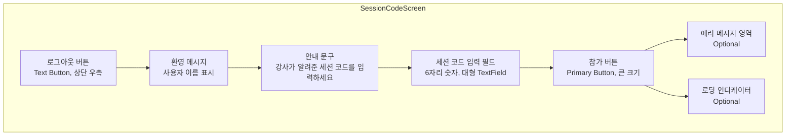

#### 필드 정보

| 요소 | 타입 | 검증 규칙 | 예시 |
|------|------|-----------|------|
| 세션 코드 | TextField (Number) | 정확히 6자리 숫자, 필수 | 123456 |

#### 주요 액션

1. **참가 버튼 클릭**
   ```
   코드 검증 → API 요청 → 세션 참가
   ```
   - API: `POST /api/students/sessions/join/`
   - Body: `{ "session_code": "123456" }`
   - Headers: `Authorization: Bearer {token}`
   - 성공 시: 세션 ID 저장 → SessionScreen 이동
   - 실패 시: 에러 메시지 표시

2. **로그아웃 버튼 클릭**
   ```
   토큰 삭제 → LoginScreen 이동
   ```

3. **코드 입력 중**
   - 6자리 입력 완료 시 자동 활성화

#### 상태 관리

```kotlin
data class SessionCodeUiState(
    val sessionCode: String = "",
    val isLoading: Boolean = false,
    val errorMessage: String? = null,
    val sessionId: Int? = null
)
```

#### 에러 상태
- 코드 형식 오류: "6자리 숫자를 입력해주세요"
- 세션 없음: "유효하지 않은 세션 코드입니다"
- 세션 종료됨: "이미 종료된 세션입니다"
- 권한 없음: "이 세션에 참가할 권한이 없습니다"

---

### 3. SessionScreen (세션 진행 화면)

#### 목적
- 실시간 학습 세션 진행
- WebSocket을 통한 강사와의 실시간 통신
- 단계 완료, 도움 요청 등 학습 액션

#### UI 구성

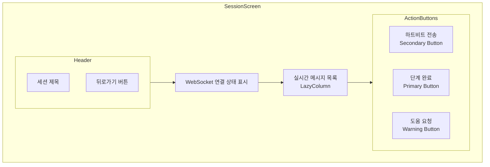

#### 화면 구성 요소

| 요소 | 설명 | 스타일 |
|------|------|--------|
| 세션 제목 | 현재 참가 중인 세션 이름 | H3, Primary Color |
| 연결 상태 | WebSocket 연결 상태 표시 | Chip (연결됨: 초록, 연결 안 됨: 빨강) |
| 메시지 목록 | 강사로부터 받은 실시간 메시지 | Card 형태, 시간 순 정렬 |
| 하트비트 버튼 | 주기적으로 활동 상태 전송 | Secondary Button, 파란색 |
| 단계 완료 버튼 | 현재 단계 완료 알림 | Primary Button, 큰 크기 |
| 도움 요청 버튼 | 강사에게 도움 요청 전송 | Warning Button, 주황색 |

#### 주요 액션

1. **WebSocket 연결**
   ```mermaid
   sequenceDiagram
       participant Screen as SessionScreen
       participant WS as WebSocket
       participant Server as Backend Server

       Screen->>WS: 연결 시도 (ws://server/ws/session/{code}/)
       WS->>Server: Connection Request
       Server-->>WS: Connection Accepted
       WS-->>Screen: onOpen() 이벤트
       Screen->>Screen: 연결 상태 업데이트 (연결됨)

       loop 메시지 수신
           Server->>WS: 메시지 전송
           WS->>Screen: onMessage() 이벤트
           Screen->>Screen: 메시지 목록 업데이트
       end
   ```

2. **하트비트 전송**
   ```json
   {
     "type": "heartbeat",
     "timestamp": "2025-11-14T12:00:00Z"
   }
   ```
   - 버튼 클릭 시 또는 자동 주기 전송 (30초마다)
   - 서버에 학생이 활동 중임을 알림

3. **단계 완료 알림**
   ```json
   {
     "type": "step_completed",
     "step_id": 1,
     "timestamp": "2025-11-14T12:05:00Z"
   }
   ```
   - 학습 단계 완료 시 강사에게 알림

4. **도움 요청**
   ```json
   {
     "type": "help_request",
     "message": "수동 도움 요청",
     "timestamp": "2025-11-14T12:10:00Z"
   }
   ```
   - 수동 도움 요청 전송
   - 강사 대시보드에 즉시 표시

5. **뒤로가기**
   ```
   WebSocket 연결 해제 → SessionCodeScreen 이동
   ```

#### 상태 관리 (SessionViewModel)

```kotlin
data class SessionUiState(
    val sessionId: Int? = null,
    val sessionTitle: String = "",
    val isWebSocketConnected: Boolean = false,
    val messages: List<WebSocketMessage> = emptyList(),
    val errorMessage: String? = null
)

data class WebSocketMessage(
    val id: String,
    val type: String,
    val content: String,
    val timestamp: Long
)
```

#### 메시지 타입

| 타입 | 발신 | 설명 | 표시 방식 |
|------|------|------|-----------|
| `session_start` | 서버 → 클라이언트 | 세션 시작 알림 | 정보 카드 (파란색) |
| `session_pause` | 서버 → 클라이언트 | 세션 일시정지 | 경고 카드 (주황색) |
| `session_resume` | 서버 → 클라이언트 | 세션 재개 | 정보 카드 (파란색) |
| `session_end` | 서버 → 클라이언트 | 세션 종료 알림 | 종료 카드 (빨간색) |
| `next_step` | 서버 → 클라이언트 | 다음 단계 진행 | 성공 카드 (초록색) |
| `notification` | 서버 → 클라이언트 | 일반 알림 | 일반 카드 (회색) |

---

## WebSocket 통신 흐름

### 연결 생명주기

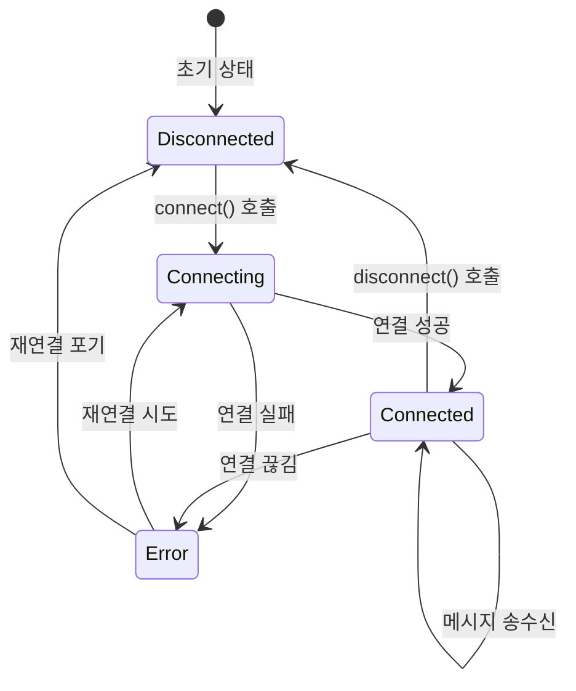

### 메시지 송수신 흐름

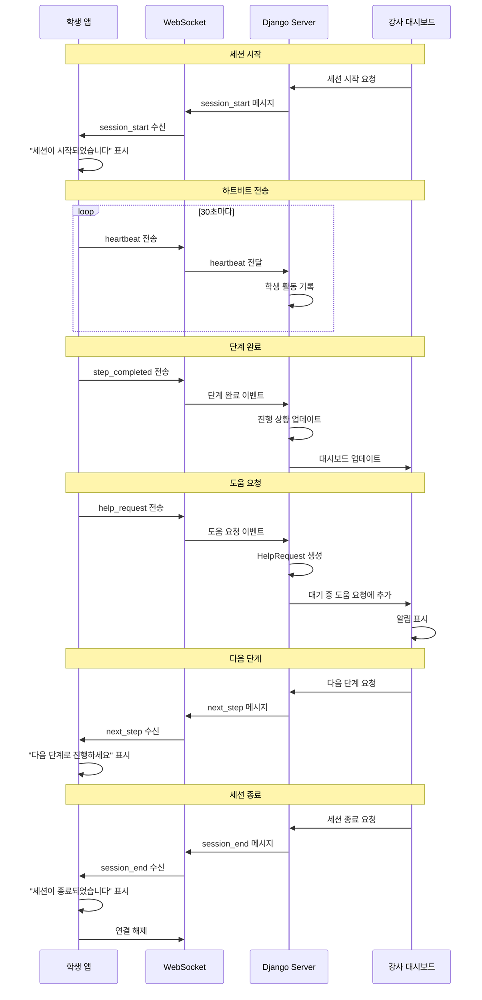

### 재연결 로직

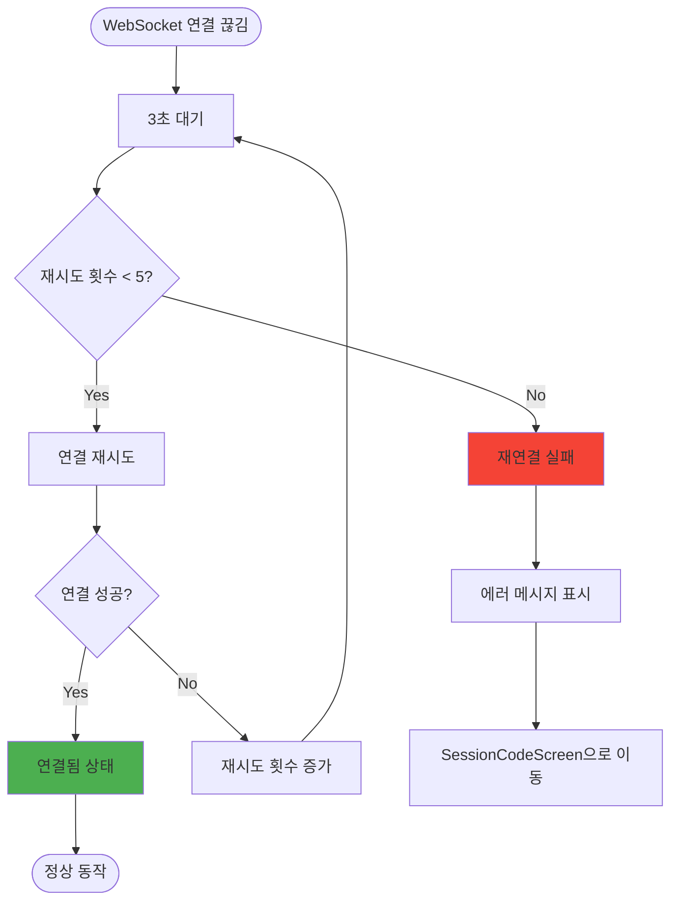

---

## AccessibilityService 동작

### 개요
- **목적**: 학생의 UI 인터랙션을 자동으로 수집하여 분석
- **권한**: 접근성 서비스 권한 필요 (시스템 설정에서 수동 활성화)
- **동작**: 백그라운드에서 지속적으로 UI 이벤트 감지

### 수집 이벤트 타입

| 이벤트 타입 | AccessibilityEvent | 설명 |
|-------------|-------------------|------|
| View Clicked | TYPE_VIEW_CLICKED | 버튼, 링크 등 클릭 |
| View Focused | TYPE_VIEW_FOCUSED | 입력 필드 포커스 |
| Text Changed | TYPE_VIEW_TEXT_CHANGED | 텍스트 입력 변경 |
| Scrolled | TYPE_VIEW_SCROLLED | 화면 스크롤 |
| Window State Changed | TYPE_WINDOW_STATE_CHANGED | 화면 전환 |

### 로그 수집 흐름

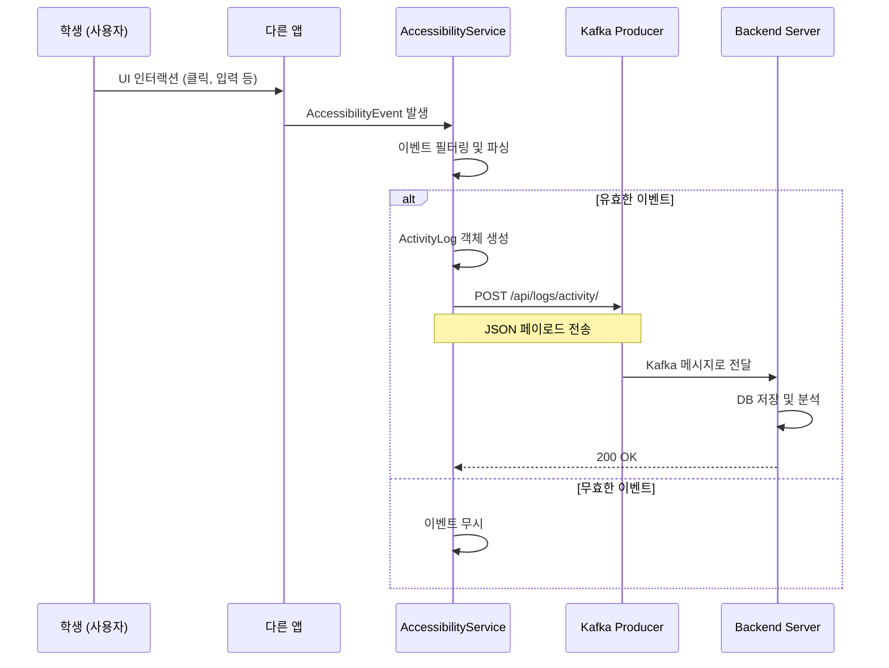

### ActivityLog 데이터 구조

```json
{
  "student_id": 1,
  "session_id": 5,
  "event_type": "VIEW_CLICKED",
  "package_name": "com.example.app",
  "class_name": "MainActivity",
  "content_description": "확인 버튼",
  "text": "확인",
  "timestamp": "2025-11-14T12:00:00Z",
  "metadata": {
    "x": 540,
    "y": 1200,
    "is_password": false
  }
}
```

### 활성화 프로세스

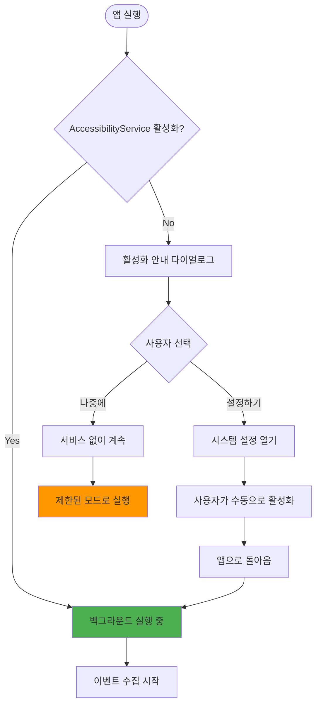

### 프라이버시 고려사항

1. **필터링**
   - 비밀번호 입력 필드는 텍스트 수집 안 함 (`isPassword` 체크)
   - 민감한 패키지 제외 (은행 앱, 결제 앱 등)

2. **투명성**
   - 사용자에게 수집 목적 명확히 안내
   - 설정에서 수집 범위 제어 가능

3. **데이터 보안**
   - HTTPS 통신
   - JWT 인증
   - 암호화된 로그 저장

---

## 에러 처리

### 네트워크 에러

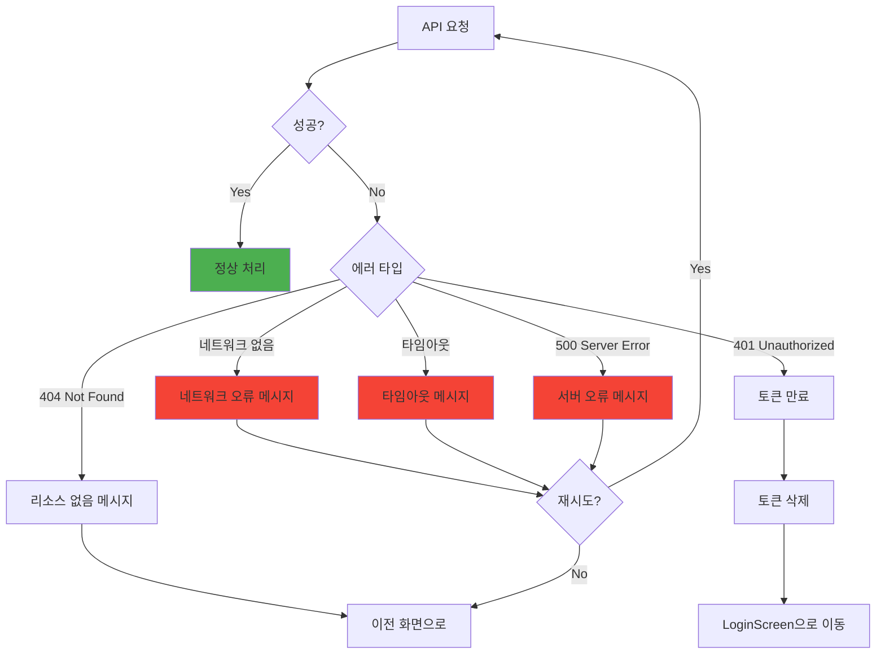

### WebSocket 에러

| 에러 코드 | 상황 | 처리 방법 |
|-----------|------|-----------|
| 1000 | 정상 종료 | 연결 종료 메시지 표시 |
| 1001 | 서버 종료 | "서버 점검 중입니다" 메시지 |
| 1006 | 비정상 종료 | 자동 재연결 시도 (최대 5회) |
| 1008 | 정책 위반 | "세션 권한이 없습니다" 메시지 |

### 사용자 입력 검증 에러

| 화면 | 필드 | 검증 규칙 | 에러 메시지 |
|------|------|-----------|-------------|
| LoginScreen | 이메일 | 이메일 형식 | "올바른 이메일 형식을 입력하세요" |
| LoginScreen | 비밀번호 | 최소 8자 | "비밀번호는 8자 이상이어야 합니다" |
| SessionCodeScreen | 세션 코드 | 6자리 숫자 | "6자리 숫자를 입력하세요" |

### 권한 에러

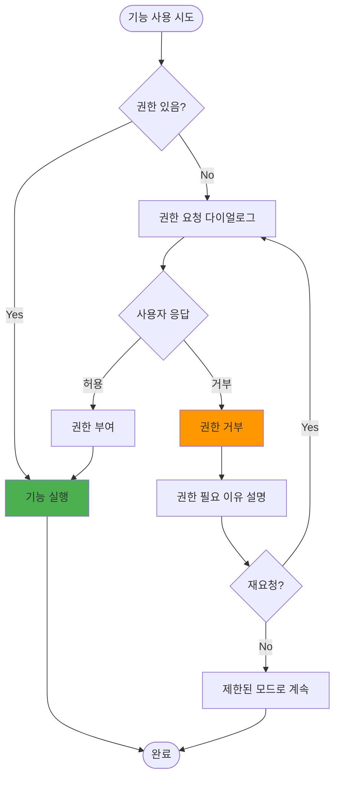

---

## 상태 지속성

### 저장되는 데이터

| 데이터 | 저장 위치 | 용도 | 만료 |
|--------|-----------|------|------|
| JWT Access Token | DataStore (암호화) | API 인증 | 1시간 |
| JWT Refresh Token | DataStore (암호화) | 토큰 갱신 | 7일 |
| 세션 ID | ViewModel (메모리) | 현재 참가 중인 세션 | 앱 종료 시 |
| 사용자 정보 | DataStore | 사용자 이름, 이메일 | 로그아웃 시 |

### 앱 생명주기와 상태 관리

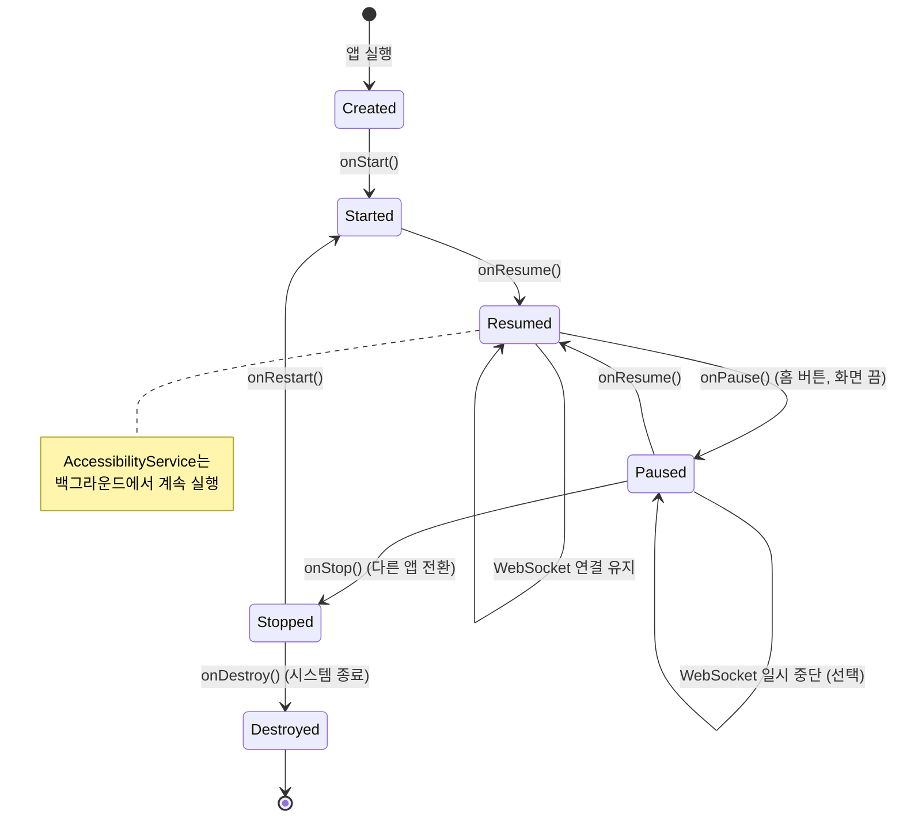

---

## 성능 최적화

### 화면 렌더링
- Jetpack Compose의 `remember`, `derivedStateOf` 활용
- 불필요한 리컴포지션 방지

### 네트워크
- Retrofit 캐싱 활용
- 이미지 로딩 시 Coil 라이브러리 사용 (필요 시)

### WebSocket
- 메시지 버퍼링 (1초에 최대 10개)
- 중복 메시지 필터링

### AccessibilityService
- 이벤트 디바운싱 (0.5초)
- 배치 전송 (10개씩 묶어서 전송)

---

## 테스트 시나리오

### 주요 테스트 케이스

1. **로그인 플로우**
   - [ ] 유효한 자격 증명으로 로그인 성공
   - [ ] 잘못된 자격 증명으로 로그인 실패
   - [ ] 네트워크 오류 시 에러 메시지 표시
   - [ ] 토큰 저장 확인

2. **세션 참가**
   - [ ] 유효한 세션 코드로 참가 성공
   - [ ] 잘못된 세션 코드로 참가 실패
   - [ ] 종료된 세션 참가 시도 시 에러

3. **WebSocket 통신**
   - [ ] 세션 시작 메시지 수신
   - [ ] 하트비트 전송 성공
   - [ ] 단계 완료 메시지 전송
   - [ ] 도움 요청 전송
   - [ ] 연결 끊김 시 재연결

4. **AccessibilityService**
   - [ ] 서비스 활성화
   - [ ] UI 이벤트 수집
   - [ ] 로그 전송
   - [ ] 비밀번호 필드 필터링

---

## 변경 이력

| 버전 | 날짜 | 변경 내용 |
|------|------|-----------|
| 1.0  | 2025-11-14 | 초안 작성 |

---

## 참고 자료

- [03_android_architecture.md](./03_android_architecture.md) - Android 앱 아키텍처
- [04_sequence_diagrams.md](./04_sequence_diagrams.md) - 시퀀스 다이어그램
- [14_websocket_protocol.md](./14_websocket_protocol.md) - WebSocket 프로토콜
