# 웹 대시보드 화면 흐름도

MobileGPT 강사용 웹 대시보드의 페이지 구조, 사용자 플로우, 주요 기능을 정의하는 문서입니다.

## 목차
1. [개요](#개요)
2. [페이지 구조](#페이지-구조)
3. [사용자 플로우](#사용자-플로우)
4. [페이지별 상세 설명](#페이지별-상세-설명)
5. [세션 제어 워크플로우](#세션-제어-워크플로우)
6. [WebSocket 통신 흐름](#websocket-통신-흐름)
7. [도움 요청 처리](#도움-요청-처리)
8. [에러 처리](#에러-처리)

---

## 개요

### 대시보드 정보
- **대상 사용자**: 시니어 교육 강사
- **플랫폼**: 웹 브라우저 (Chrome, Edge, Safari)
- **기술 스택**: React 19, TypeScript, Material-UI v7, Vite
- **아키텍처**: SPA (Single Page Application)

### 주요 기능
1. 강의 및 세션 관리
2. 실시간 학생 모니터링
3. 세션 제어 (시작, 일시정지, 재개, 종료, 다음 단계)
4. 도움 요청 처리
5. 통계 및 분석

---

## 페이지 구조

### 페이지 목록

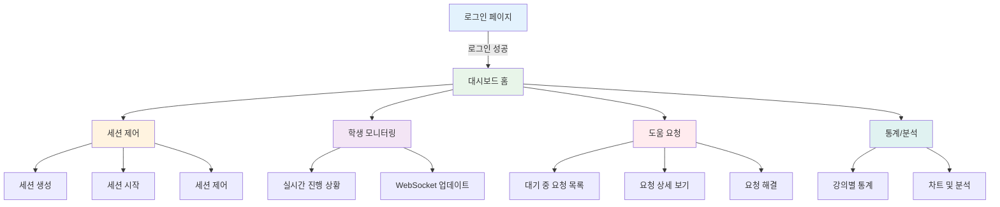

### 라우팅 구조

| 페이지 | Route | 권한 | 설명 |
|--------|-------|------|------|
| LoginPage | `/login` | 공개 | 로그인 화면 |
| DashboardPage | `/` | INSTRUCTOR | 홈 대시보드 |
| **LiveSessionPage** | `/live-session/:sessionId` | INSTRUCTOR | **실시간 강의 화면 (통합)** |
| SessionControlPage | `/sessions` | INSTRUCTOR | 세션 생성 및 관리 (구버전) |
| MonitoringPage | `/monitoring` | INSTRUCTOR | 학생 모니터링 (구버전) |
| HelpRequestsPage | `/help` | INSTRUCTOR | 도움 요청 관리 (구버전) |
| StatisticsPage | `/statistics` | INSTRUCTOR | 통계 및 분석 |

**주요 변경사항**:
- **LiveSessionPage** 추가: 세션 제어 + 학생 모니터링 + 도움 요청을 하나의 화면에 통합
- 기존 SessionControlPage, MonitoringPage, HelpRequestsPage는 세션 진행 중에는 LiveSessionPage로 대체
- 세션 생성 및 종료 후 통계는 기존 페이지 활용

---

## 사용자 플로우

### 전체 사용자 여정

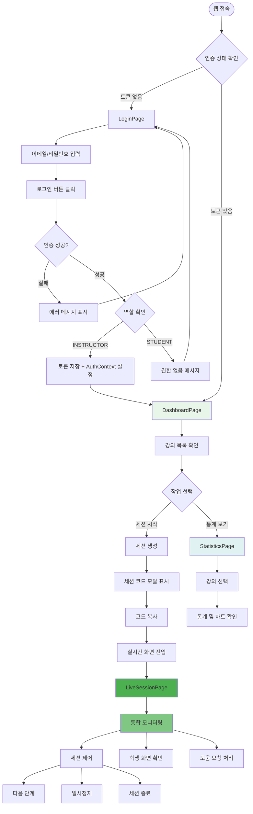

---

## 페이지별 상세 설명

### 1. LoginPage (로그인 페이지)

#### 목적
- 강사 인증 및 JWT 토큰 획득
- INSTRUCTOR 권한 확인

#### UI 구성

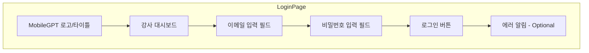

#### 필드 정보

| 요소 | 타입 | 검증 규칙 | 예시 |
|------|------|-----------|------|
| 이메일 | TextField | 이메일 형식, 필수 | instructor@test.com |
| 비밀번호 | TextField (Password) | 최소 8자, 필수 | TestInstructor123!@# |

#### 주요 액션

1. **로그인 버튼 클릭**
   ```
   입력값 검증 → API 요청 → 역할 확인 → 토큰 저장 → 리다이렉트
   ```
   - API: `POST /api/auth/login/`
   - Body: `{ "email": "...", "password": "..." }`
   - 성공 시:
     - `role === "INSTRUCTOR"` 확인
     - Access/Refresh Token 저장 (localStorage)
     - AuthContext 업데이트
     - DashboardPage로 리다이렉트
   - 실패 시: 에러 알림 표시

#### 상태 관리

```typescript
interface LoginState {
  email: string;
  password: string;
  loading: boolean;
  error: string | null;
}
```

#### 에러 상태
- 네트워크 오류: "네트워크 연결을 확인해주세요"
- 인증 실패: "이메일 또는 비밀번호가 올바르지 않습니다"
- 권한 없음: "강사 계정만 접근할 수 있습니다"
- 서버 오류: "서버 오류가 발생했습니다"

---

### 2. DashboardPage (대시보드 홈)

#### 목적
- 강사의 강의 목록 확인
- 빠른 액션 바로가기
- 대기 중인 도움 요청 개수 확인

#### UI 구성

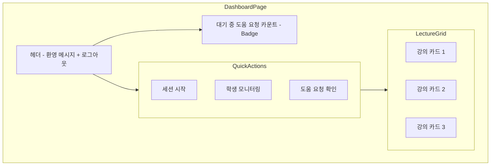

#### 강의 카드 구성

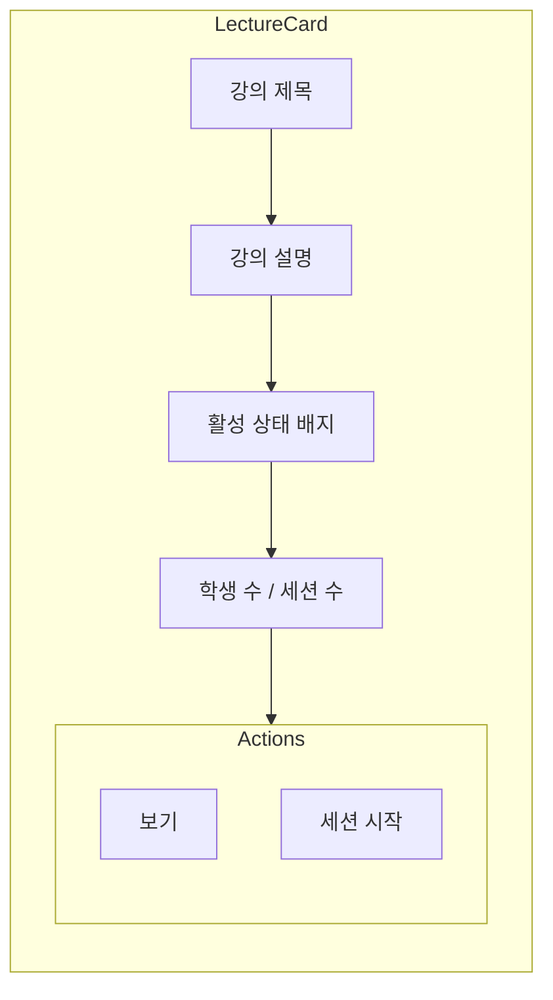

#### 데이터 로딩

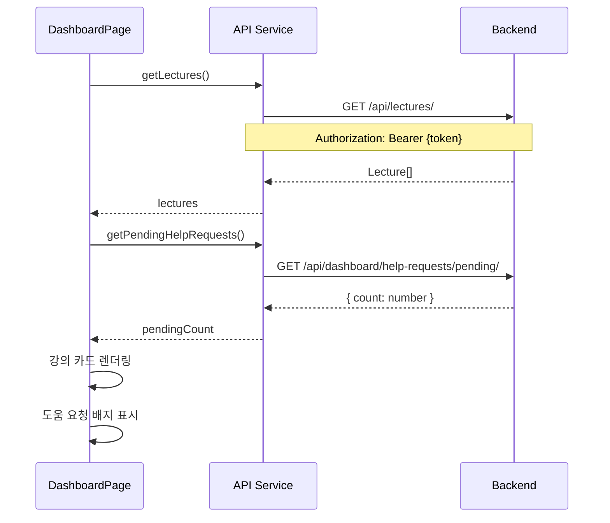

#### 주요 액션

1. **세션 시작 버튼**
   - 세션 생성 모달 표시
   - 세션 코드 발급 후 `/live-session/{sessionId}` 페이지로 이동

2. **통계 보기 버튼**
   - `/statistics` 페이지로 이동

3. **강의 카드 클릭**
   - 강의 상세 정보 확인 또는 세션 생성 모달 표시

---

### 3. LiveSessionPage (실시간 강의 화면) ⭐ 신규

#### 목적
- **통합 실시간 강의 화면**: 세션 제어 + 학생 모니터링 + 도움 요청 처리를 하나의 화면에서 수행
- Zoom 스타일의 3-Column 레이아웃

#### 화면 구성

```
┌─────────────────────────────────────────────────────────────┐
│  상단 컨트롤 바: 세션 정보, 제어 버튼, 타이머                │
├──────────┬────────────────────────────────┬──────────────────┤
│          │                                │                  │
│  좌측    │        중앙 영역                │     우측         │
│  패널    │     (학생 화면)                 │     패널         │
│          │                                │                  │
│  - 강의  │      선택한 학생의             │  - 참가자        │
│    정보  │      Android 화면              │    현황          │
│  - 수강생│      실시간 미러링             │  - 그룹별        │
│    목록  │                                │    학습 내용     │
│  - 진도  │      (9:16 비율)               │  - 실시간        │
│    차트  │                                │    알림          │
│          │                                │                  │
└──────────┴────────────────────────────────┴──────────────────┘
```

**상세 문서**: [10_live_session_page.md](./10_live_session_page.md) 참조

#### 주요 기능

1. **좌측 패널**:
   - 강의 정보 (강의명, 날짜, 강사, 수강 인원)
   - 수강생 목록 (클릭 시 중앙에 화면 표시)
   - 진도 차트 (전체, 50대, 60대, 70대)

2. **중앙 영역**:
   - 선택한 학생의 Android 화면 실시간 미러링
   - 페이지네이션 (다른 학생으로 빠르게 전환)

3. **우측 패널**:
   - 참가자 현황 (아바타 표시)
   - 그룹별 학습 내용
   - 실시간 알림 (도움 요청, 진도 알림 등)

4. **상단 컨트롤 바**:
   - 세션 제어 버튼 (시작/일시정지/재개/다음 단계/종료)
   - 경과 시간 타이머
   - 사용자 메뉴

#### 세션 진입 플로우

```mermaid
flowchart TD
    Dashboard[대시보드 홈] --> SelectLecture[강의 선택]
    SelectLecture --> CreateSession[세션 생성 API 호출]
    CreateSession --> ShowModal[세션 코드 모달 표시]

    ShowModal --> CopyCode[코드 복사]
    CopyCode --> ClickEnter[실시간 화면 진입 버튼]

    ClickEnter --> LiveSession[/live-session/{sessionId}]

    LiveSession --> Init[3개 WebSocket 연결]
    Init --> WaitStudents[학생 참가 대기]
    WaitStudents --> Start[시작 버튼 클릭]
    Start --> MonitorLive[실시간 모니터링]

    style LiveSession fill:#4CAF50
    style MonitorLive fill:#81C784
```

#### WebSocket 연결

실시간 화면은 3개의 WebSocket을 동시에 연결:

1. **세션 제어 WebSocket**: `ws://server/ws/sessions/{sessionCode}/`
   - 참가자 추가/퇴장 알림

2. **모니터링 WebSocket**: `ws://server/ws/dashboard/lectures/{lectureId}/`
   - 진행 상황 업데이트
   - 도움 요청 알림

3. **화면 미러링 WebSocket**: `ws://server/ws/screen-mirror/{studentId}/`
   - 학생 화면 이미지 스트리밍

---

### 4. SessionControlPage (세션 제어 페이지) - 구버전

#### 목적
- 세션 생성, 시작, 제어
- 세션 코드 공유
- 참가 학생 실시간 확인

#### UI 구성

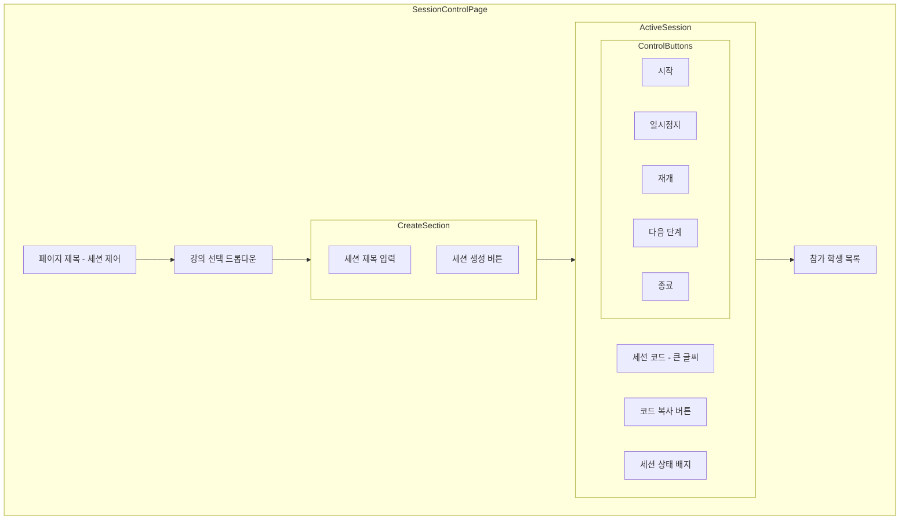

#### 세션 생성 플로우

```mermaid
flowchart TD
    Start([세션 제어 페이지 진입]) --> SelectLec[강의 선택]
    SelectLec --> InputTitle[세션 제목 입력]
    InputTitle --> ClickCreate[생성 버튼 클릭]

    ClickCreate --> APICall[POST /api/sessions/]
    APICall --> Success{성공?}

    Success -->|Yes| ShowCode[세션 코드 표시]
    Success -->|No| ShowError[에러 메시지]

    ShowCode --> CopyCode{코드 복사?}
    CopyCode -->|Yes| Copied[클립보드에 복사]
    CopyCode -->|No| ShareManual[수동으로 공유]

    Copied --> WaitStudents[학생 참가 대기]
    ShareManual --> WaitStudents

    WaitStudents --> PollList[5초마다 참가자 목록 새로고침]
    PollList --> StudentsJoin{학생 참가?}

    StudentsJoin -->|Yes| UpdateList[참가자 목록 업데이트]
    StudentsJoin -->|No| PollList

    UpdateList --> ReadyToStart[세션 시작 준비]
    ReadyToStart --> ClickStart[시작 버튼 클릭]

    ClickStart --> StartSession[POST /api/sessions/{id}/start/]
    StartSession --> SessionActive[세션 활성화]

    style ShowCode fill:#4CAF50
    style SessionActive fill:#4CAF50
    style ShowError fill:#F44336
```

#### 세션 상태 전환

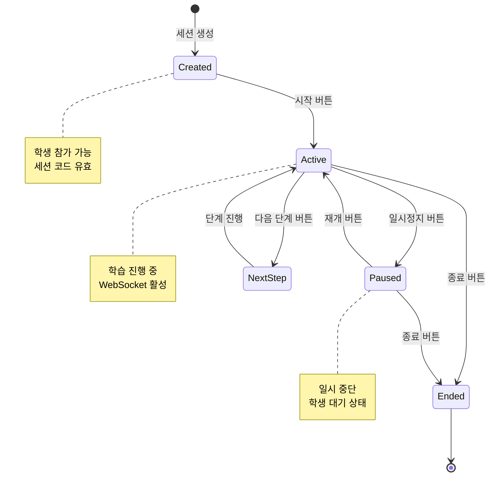

#### 제어 버튼 동작

| 버튼 | API 엔드포인트 | 조건 | 효과 |
|------|----------------|------|------|
| 시작 | `POST /api/sessions/{id}/start/` | 상태: Created | Active로 변경, 모든 학생에게 알림 |
| 일시정지 | `POST /api/sessions/{id}/pause/` | 상태: Active | Paused로 변경, 학습 중단 |
| 재개 | `POST /api/sessions/{id}/resume/` | 상태: Paused | Active로 변경, 학습 재개 |
| 다음 단계 | `POST /api/sessions/{id}/next-step/` | 상태: Active | 다음 Subtask로 진행 |
| 종료 | `POST /api/sessions/{id}/end/` | 모든 상태 | Ended로 변경, 세션 종료 |

#### 참가 학생 목록

```typescript
interface Participant {
  id: number;
  name: string;
  email: string;
  joinedAt: string;
  isActive: boolean;
}
```

- **새로고침**: 5초마다 자동 폴링
- **표시**: Table 형태 (이름, 이메일, 참가 시간, 상태)
- **상태**: Active (초록), Inactive (회색)

---

### 4. MonitoringPage (학생 모니터링 페이지)

#### 목적
- 강의별 학생 진행 상황 실시간 확인
- WebSocket을 통한 실시간 업데이트
- 도움이 필요한 학생 신속 파악

#### UI 구성

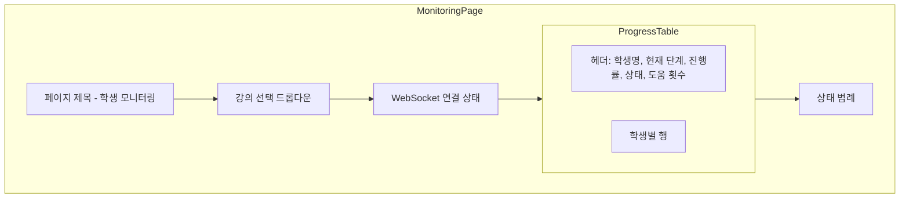

#### 진행 상황 테이블

| 열 | 설명 | 표시 방식 |
|----|------|-----------|
| 학생명 | 학생 이름 | 텍스트 |
| 현재 단계 | Task/Subtask 이름 | 텍스트 |
| 진행률 | 완료된 Subtask / 전체 Subtask | Progress Bar (%) |
| 상태 | 진행 상태 | Chip (색상별) |
| 도움 횟수 | 도움 요청한 횟수 | 숫자 + 아이콘 |
| 마지막 활동 | 마지막 활동 시간 | 상대 시간 (예: 2분 전) |

#### 상태 색상 코드

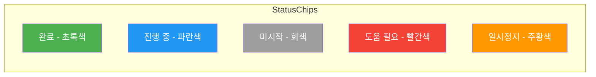

#### WebSocket 통신

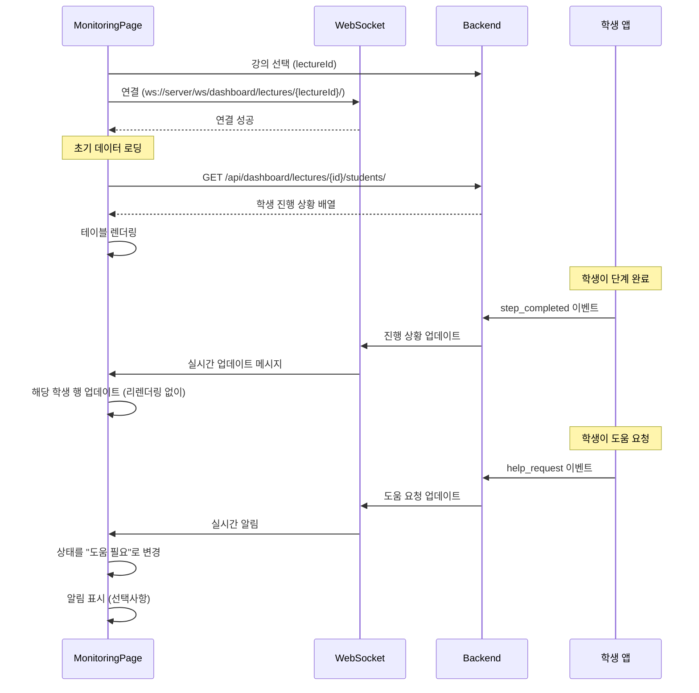

#### 실시간 업데이트 메시지 포맷

```typescript
interface MonitoringUpdate {
  type: 'progress_update' | 'help_request' | 'status_change';
  studentId: number;
  data: {
    currentStep?: string;
    progress?: number;
    status?: 'completed' | 'in_progress' | 'not_started' | 'help_needed';
    helpCount?: number;
    lastActivity?: string;
  };
}
```

#### 주요 액션

1. **강의 선택**
   - 새로운 강의 선택 시 WebSocket 재연결
   - 테이블 데이터 새로고침

2. **도움 필요 학생 클릭**
   - 해당 학생의 도움 요청 상세로 이동 (`/help`)

3. **새로고침 버튼**
   - 수동으로 최신 데이터 가져오기

---

### 5. HelpRequestsPage (도움 요청 관리 페이지)

#### 목적
- 대기 중인 도움 요청 확인
- M-GPT 분석 결과 확인
- 도움 요청 해결 처리

#### UI 구성

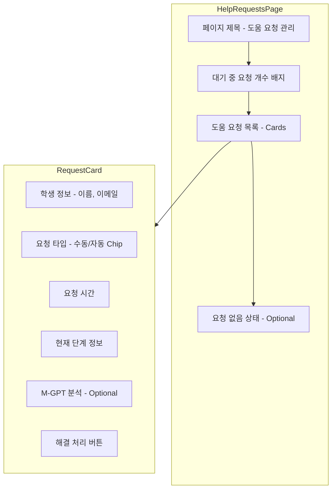

#### 도움 요청 타입

| 타입 | 설명 | 배지 색상 |
|------|------|-----------|
| MANUAL | 학생이 직접 요청 버튼 클릭 | 주황색 (Warning) |
| AUTO | 시스템이 자동으로 감지 (오래 정체, 반복 실수 등) | 빨간색 (Error) |

#### 데이터 로딩 플로우

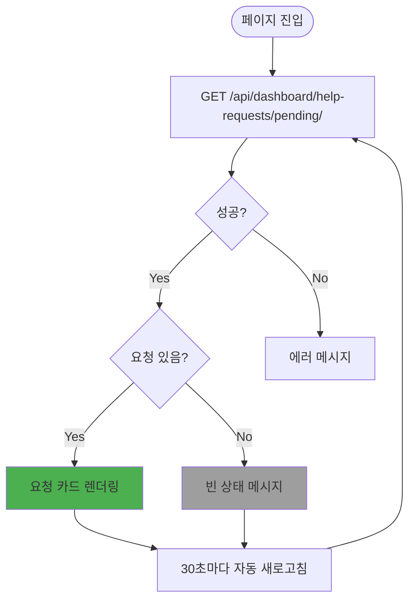

#### 도움 요청 해결 워크플로우

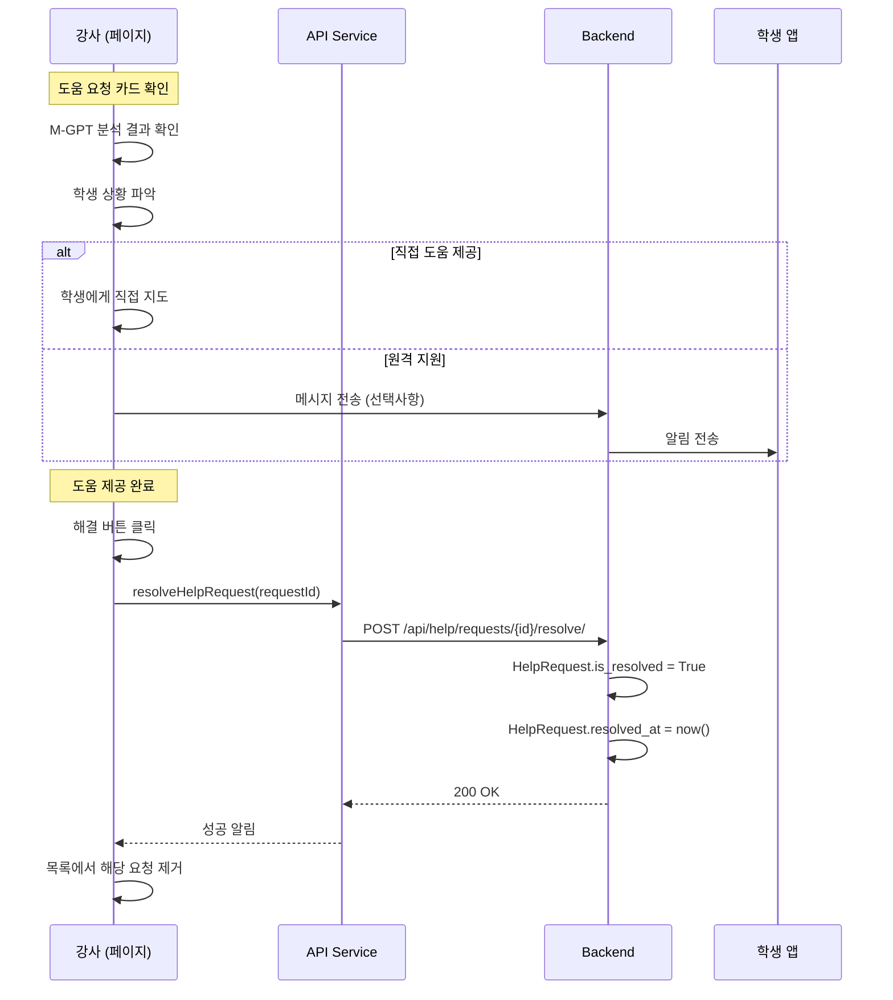

#### M-GPT 분석 정보 (선택사항)

```typescript
interface MgptAnalysis {
  difficulty_level: number;      // 1-10
  stuck_duration: number;         // 초 단위
  error_patterns: string[];       // 반복된 오류 패턴
  suggested_hint: string;         // AI가 제안하는 힌트
  confidence: number;             // 0-1
}
```

#### 주요 액션

1. **해결 버튼 클릭**
   - API 호출로 `is_resolved = True` 설정
   - 목록에서 제거
   - 성공 알림 표시

2. **학생 이름 클릭**
   - 학생 상세 정보 모달 (선택사항)
   - 또는 모니터링 페이지에서 해당 학생으로 스크롤

3. **자동 새로고침**
   - 30초마다 대기 중 요청 목록 갱신

---

### 6. StatisticsPage (통계 및 분석 페이지)

#### 목적
- 강의별 통계 데이터 확인
- 어려운 단계 분석
- 학생 수, 도움 요청 수 등 메트릭 확인

#### UI 구성

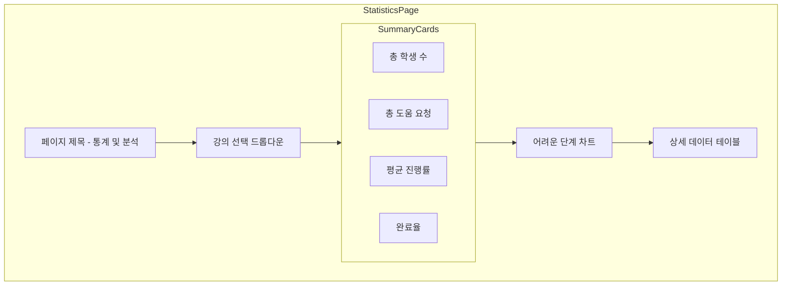

#### 요약 카드 구성

```mermaid
graph LR
    subgraph Card1
        Icon1[👥 아이콘]
        Label1[총 학생 수]
        Value1[15명]
    end

    subgraph Card2
        Icon2[🆘 아이콘]
        Label2[총 도움 요청]
        Value2[23회]
    end

    subgraph Card3
        Icon3[📊 아이콘]
        Label3[평균 진행률]
        Value3[67%]
    end

    subgraph Card4
        Icon4[✅ 아이콘]
        Label4[완료율]
        Value4[12/15 (80%)]
    end

    style Card1 fill:#E3F2FD
    style Card2 fill:#FFEBEE
    style Card3 fill:#E8F5E9
    style Card4 fill:#FFF3E0
```

#### 어려운 단계 차트

- **차트 타입**: Bar Chart (Recharts)
- **X축**: Subtask 이름
- **Y축**: 도움 요청 횟수 또는 평균 소요 시간
- **색상**: 값에 따라 그라데이션 (초록 → 주황 → 빨강)

```typescript
interface DifficultStep {
  subtaskName: string;
  helpRequestCount: number;
  avgTimeSpent: number; // 초 단위
  studentCount: number;
}
```

#### 데이터 로딩

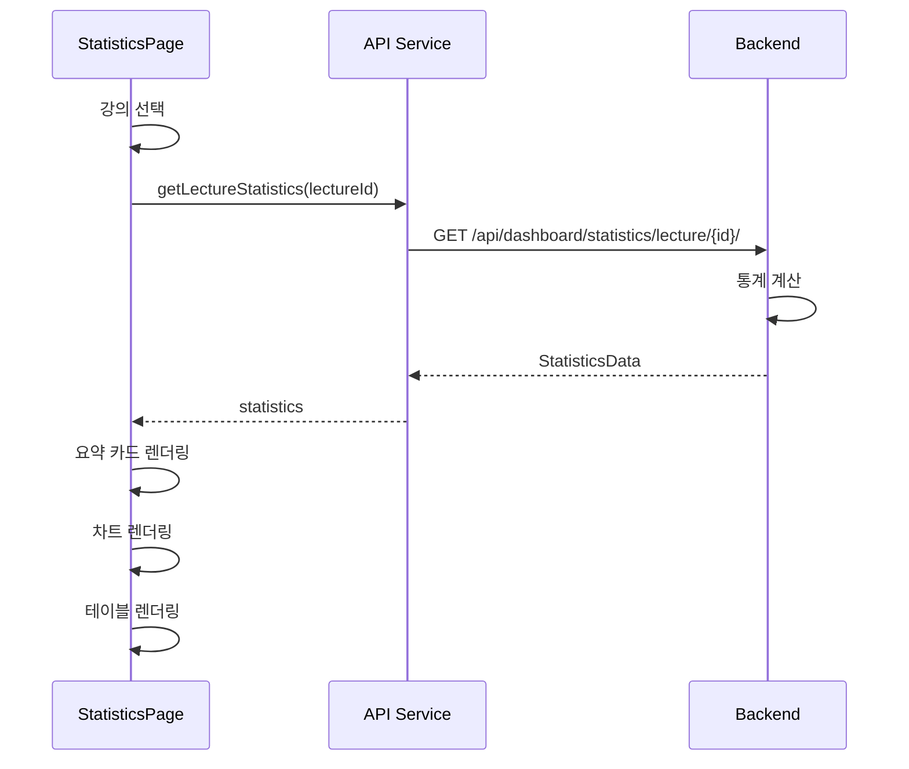

#### 통계 데이터 구조

```typescript
interface LectureStatistics {
  lectureId: number;
  lectureName: string;
  totalStudents: number;
  totalHelpRequests: number;
  averageProgress: number; // 0-100
  completionRate: number; // 0-100
  difficultSteps: DifficultStep[];
  lastUpdated: string;
}
```

#### 주요 액션

1. **강의 선택**
   - 새로운 강의 통계 로딩
   - 모든 차트 및 데이터 업데이트

2. **차트 인터랙션**
   - 바 클릭 시 해당 Subtask 상세 정보 표시

3. **새로고침 버튼**
   - 최신 통계 데이터 다시 로딩

---

## 세션 제어 워크플로우

### 전체 세션 생명주기

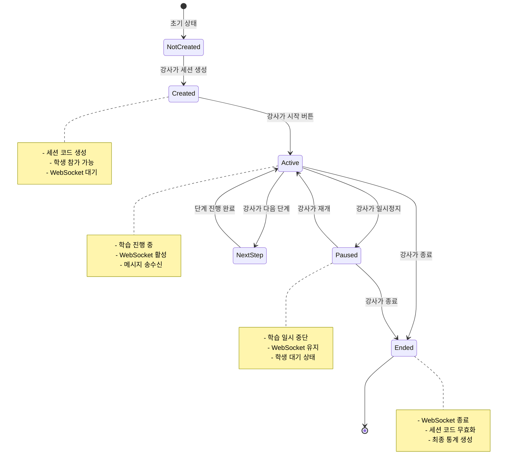

### 세션 제어 시퀀스 다이어그램

```mermaid
sequenceDiagram
    participant Instructor as 강사 대시보드
    participant API as API Service
    participant Server as Backend
    participant WS as WebSocket Server
    participant Student as 학생 앱

    Note over Instructor,Student: 1. 세션 생성

    Instructor->>API: createSession(lectureId, title)
    API->>Server: POST /api/sessions/
    Server->>Server: 6자리 코드 생성
    Server->>Server: Session 생성 (status=CREATED)
    Server-->>API: Session 객체 (+ code)
    API-->>Instructor: session
    Instructor->>Instructor: 세션 코드 표시

    Note over Instructor,Student: 2. 학생 참가

    Student->>Server: POST /api/students/sessions/join/ (code)
    Server->>Server: 세션 검증 및 학생 추가
    Server-->>Student: 성공 응답
    Student->>WS: WebSocket 연결 (ws://server/ws/session/{code}/)
    WS-->>Student: 연결 성공

    Instructor->>Server: 주기적 폴링 - 참가자 목록
    Server-->>Instructor: Participant[]

    Note over Instructor,Student: 3. 세션 시작

    Instructor->>API: startSession(sessionId)
    API->>Server: POST /api/sessions/{id}/start/
    Server->>Server: status = ACTIVE
    Server->>WS: session_start 메시지 브로드캐스트
    WS->>Student: session_start 수신
    Student->>Student: "세션이 시작되었습니다" 표시

    Note over Instructor,Student: 4. 학습 진행 (하트비트)

    loop 30초마다
        Student->>WS: heartbeat 전송
        WS->>Server: 학생 활동 기록
    end

    Note over Instructor,Student: 5. 다음 단계

    Instructor->>API: nextStep(sessionId)
    API->>Server: POST /api/sessions/{id}/next-step/
    Server->>Server: 현재 Subtask 인덱스 증가
    Server->>WS: next_step 메시지 브로드캐스트
    WS->>Student: next_step 수신
    Student->>Student: "다음 단계로 진행하세요" 표시

    Note over Instructor,Student: 6. 일시정지 및 재개

    Instructor->>API: pauseSession(sessionId)
    API->>Server: POST /api/sessions/{id}/pause/
    Server->>Server: status = PAUSED
    Server->>WS: session_pause 메시지
    WS->>Student: session_pause 수신
    Student->>Student: "일시 정지되었습니다" 표시

    Instructor->>API: resumeSession(sessionId)
    API->>Server: POST /api/sessions/{id}/resume/
    Server->>Server: status = ACTIVE
    Server->>WS: session_resume 메시지
    WS->>Student: session_resume 수신
    Student->>Student: "재개되었습니다" 표시

    Note over Instructor,Student: 7. 세션 종료

    Instructor->>API: endSession(sessionId)
    API->>Server: POST /api/sessions/{id}/end/
    Server->>Server: status = ENDED, ended_at = now()
    Server->>WS: session_end 메시지 브로드캐스트
    WS->>Student: session_end 수신
    Student->>Student: "세션이 종료되었습니다" 표시
    Student->>WS: 연결 해제
    Instructor->>Instructor: 세션 제어 화면 초기화
```

---

## WebSocket 통신 흐름

### 대시보드 WebSocket 연결

#### MonitoringPage WebSocket

```
엔드포인트: ws://server/ws/dashboard/lectures/{lectureId}/
목적: 강의별 학생 진행 상황 실시간 업데이트
```

**메시지 타입**:

1. **progress_update** (서버 → 클라이언트)
   ```json
   {
     "type": "progress_update",
     "student_id": 3,
     "data": {
       "current_step": "Task 1 - Subtask 2",
       "progress": 45,
       "status": "in_progress",
       "last_activity": "2025-11-14T12:30:00Z"
     }
   }
   ```

2. **help_request** (서버 → 클라이언트)
   ```json
   {
     "type": "help_request",
     "student_id": 3,
     "data": {
       "help_count": 2,
       "status": "help_needed",
       "request_type": "MANUAL"
     }
   }
   ```

3. **status_change** (서버 → 클라이언트)
   ```json
   {
     "type": "status_change",
     "student_id": 3,
     "data": {
       "status": "completed"
     }
   }
   ```

#### SessionControlPage WebSocket

```
엔드포인트: ws://server/ws/sessions/{sessionCode}/
목적: 세션 상태 및 참가자 실시간 업데이트
```

**메시지 타입**:

1. **participant_joined** (서버 → 클라이언트)
   ```json
   {
     "type": "participant_joined",
     "participant": {
       "id": 5,
       "name": "학생5",
       "email": "student5@test.com",
       "joined_at": "2025-11-14T12:00:00Z"
     }
   }
   ```

2. **session_status_change** (서버 → 클라이언트)
   ```json
   {
     "type": "session_status_change",
     "status": "ACTIVE",
     "timestamp": "2025-11-14T12:05:00Z"
     }
   ```

### 연결 관리

```mermaid
flowchart TD
    Start([페이지 진입]) --> Check{WebSocket 필요?}

    Check -->|Yes| Connect[WebSocket 연결 시도]
    Check -->|No| NoWS[WebSocket 없이 진행]

    Connect --> Success{연결 성공?}

    Success -->|Yes| Connected[연결됨 상태]
    Success -->|No| Retry{재시도 < 3?}

    Retry -->|Yes| Wait[2초 대기]
    Wait --> Connect
    Retry -->|No| Failed[연결 실패 메시지]

    Connected --> Listen[메시지 수신 대기]
    Listen --> Update[UI 업데이트]
    Update --> Listen

    Connected --> Disconnect{페이지 이탈?}
    Disconnect -->|Yes| Close[연결 종료]
    Disconnect -->|No| Listen

    Close --> End([종료])
    Failed --> NoWS
    NoWS --> End

    style Connected fill:#4CAF50
    style Failed fill:#F44336
```

---

## 도움 요청 처리

### 도움 요청 전체 플로우

```mermaid
sequenceDiagram
    participant Student as 학생 앱
    participant WS as WebSocket
    participant Server as Backend
    participant Dashboard as 강사 대시보드
    participant Instructor as 강사

    Note over Student,Instructor: 1. 도움 요청 발생

    alt 수동 요청
        Student->>Student: 도움 요청 버튼 클릭
        Student->>WS: help_request 메시지
    else 자동 감지
        Server->>Server: 학생 활동 분석 (오래 정체, 반복 오류)
        Server->>Server: HelpRequest 자동 생성 (type=AUTO)
    end

    WS->>Server: 도움 요청 이벤트
    Server->>Server: HelpRequest 생성 (is_resolved=False)

    Note over Student,Instructor: 2. 강사에게 알림

    Server->>Dashboard: WebSocket 업데이트 (help_request)
    Dashboard->>Dashboard: 대기 중 카운트 증가
    Dashboard->>Dashboard: 알림 배지 표시 (선택)

    Note over Student,Instructor: 3. 강사가 확인

    Instructor->>Dashboard: /help 페이지 이동
    Dashboard->>Server: GET /api/dashboard/help-requests/pending/
    Server-->>Dashboard: HelpRequest[]
    Dashboard->>Dashboard: 요청 카드 렌더링

    Instructor->>Instructor: M-GPT 분석 확인
    Instructor->>Instructor: 학생 상황 파악

    Note over Student,Instructor: 4. 도움 제공

    alt 직접 도움
        Instructor->>Student: 직접 지도 (오프라인/대면)
    else 원격 지원
        Instructor->>Server: 메시지 전송 (선택사항)
        Server->>WS: 알림 전송
        WS->>Student: 알림 수신
    end

    Note over Student,Instructor: 5. 해결 처리

    Instructor->>Dashboard: 해결 버튼 클릭
    Dashboard->>Server: POST /api/help/requests/{id}/resolve/
    Server->>Server: is_resolved = True, resolved_at = now()
    Server-->>Dashboard: 200 OK
    Dashboard->>Dashboard: 목록에서 제거
    Dashboard->>Dashboard: 성공 알림
```

---

## 에러 처리

### 네트워크 에러

```mermaid
flowchart TD
    Request[API 요청] --> Response{응답 상태}

    Response -->|200-299 OK| Success[정상 처리]
    Response -->|401 Unauthorized| Unauthorized[인증 오류]
    Response -->|403 Forbidden| Forbidden[권한 없음]
    Response -->|404 Not Found| NotFound[리소스 없음]
    Response -->|500 Server Error| ServerError[서버 오류]
    Response -->|Network Error| NetworkError[네트워크 오류]

    Unauthorized --> ClearToken[토큰 삭제]
    ClearToken --> RedirectLogin[로그인 페이지로 리다이렉트]

    Forbidden --> ShowForbidden[권한 없음 메시지]
    NotFound --> ShowNotFound[리소스 없음 메시지]
    ServerError --> ShowServerError[서버 오류 메시지]
    NetworkError --> ShowNetworkError[네트워크 오류 메시지]

    ShowForbidden --> Back[이전 페이지]
    ShowNotFound --> Back
    ShowServerError --> Retry{재시도?}
    ShowNetworkError --> Retry

    Retry -->|Yes| Request
    Retry -->|No| Back

    Success --> End([완료])
    RedirectLogin --> End
    Back --> End

    style Success fill:#4CAF50
    style Unauthorized fill:#F44336
    style ServerError fill:#F44336
    style NetworkError fill:#F44336
```

### 에러 메시지 표시

| 에러 타입 | Alert 타입 | 메시지 | 액션 |
|-----------|-----------|--------|------|
| 401 Unauthorized | Error | "로그인이 만료되었습니다. 다시 로그인해주세요" | 로그인 페이지 리다이렉트 |
| 403 Forbidden | Error | "이 작업을 수행할 권한이 없습니다" | 이전 페이지 |
| 404 Not Found | Warning | "요청한 리소스를 찾을 수 없습니다" | 이전 페이지 |
| 500 Server Error | Error | "서버 오류가 발생했습니다. 잠시 후 다시 시도해주세요" | 재시도 버튼 |
| Network Error | Error | "네트워크 연결을 확인해주세요" | 재시도 버튼 |

### WebSocket 에러

| 상황 | 처리 방법 |
|------|-----------|
| 연결 실패 | 3회 재시도 후 에러 메시지 표시 |
| 연결 끊김 | 자동 재연결 시도 (5회) |
| 메시지 파싱 오류 | 로그 기록, 사용자에게 표시 안 함 |
| 타임아웃 | 연결 재설정 |

---

## 레이아웃 및 네비게이션

### 공통 레이아웃 (Layout Component)

```mermaid
graph TB
    subgraph Layout
        AppBar[앱 바 - 상단]
        Sidebar[사이드바 - 좌측]
        MainContent[메인 컨텐츠 영역]
    end

    subgraph AppBar
        Logo[MobileGPT 로고]
        Title[페이지 제목]
        UserMenu[사용자 메뉴 - 드롭다운]
    end

    subgraph Sidebar
        Nav1[대시보드]
        Nav2[세션 제어]
        Nav3[학생 모니터링]
        Nav4[도움 요청]
        Nav5[통계]
    end

    subgraph UserMenu
        Profile[프로필]
        Logout[로그아웃]
    end

    AppBar --> Sidebar
    Sidebar --> MainContent
```

### 네비게이션 메뉴

| 메뉴 항목 | 아이콘 | Route | 설명 |
|-----------|--------|-------|------|
| 대시보드 | 🏠 Dashboard | `/` | 홈 화면 |
| 세션 제어 | 🎮 Control | `/sessions` | 세션 관리 |
| 학생 모니터링 | 👁️ Monitor | `/monitoring` | 진행 상황 확인 |
| 도움 요청 | 🆘 Help | `/help` | 도움 요청 관리 |
| 통계 | 📊 Statistics | `/statistics` | 통계 및 분석 |

---

## 성능 최적화

### 데이터 로딩
- **Lazy Loading**: 페이지별로 컴포넌트 지연 로딩
- **Pagination**: 큰 목록은 페이지네이션 적용 (필요 시)
- **Caching**: API 응답 캐싱 (React Query 또는 SWR)

### WebSocket
- **메시지 쓰로틀링**: 1초에 최대 10개 메시지 처리
- **메모이제이션**: WebSocket 메시지 처리 시 React.memo 활용

### 렌더링
- **React.memo**: 불필요한 리렌더링 방지
- **useMemo, useCallback**: 연산 최적화
- **Virtual Scrolling**: 긴 목록 (100개 이상) 시 가상 스크롤링

---

## 테스트 시나리오

### 주요 테스트 케이스

1. **로그인 및 인증**
   - [ ] 유효한 강사 계정으로 로그인
   - [ ] 학생 계정으로 로그인 시도 시 권한 오류
   - [ ] 잘못된 자격 증명으로 로그인 실패

2. **세션 생명주기**
   - [ ] 세션 생성 및 코드 발급
   - [ ] 세션 시작 → 학생에게 알림 전송
   - [ ] 일시정지 → 재개
   - [ ] 다음 단계 진행
   - [ ] 세션 종료

3. **실시간 모니터링**
   - [ ] WebSocket 연결 성공
   - [ ] 학생 진행 상황 실시간 업데이트
   - [ ] 도움 요청 실시간 알림

4. **도움 요청 관리**
   - [ ] 대기 중 요청 목록 조회
   - [ ] 요청 해결 처리
   - [ ] 해결 후 목록에서 제거

5. **통계 및 분석**
   - [ ] 강의별 통계 조회
   - [ ] 차트 렌더링
   - [ ] 어려운 단계 파악

---

## 변경 이력

| 버전 | 날짜 | 변경 내용 |
|------|------|-----------|
| 1.0  | 2025-11-14 | 초안 작성 |

---

## 참고 자료

- [06_web_dashboard_architecture.md](./06_web_dashboard_architecture.md) - 웹 대시보드 아키텍처
- [04_sequence_diagrams.md](./04_sequence_diagrams.md) - 시퀀스 다이어그램
- [14_websocket_protocol.md](./14_websocket_protocol.md) - WebSocket 프로토콜
