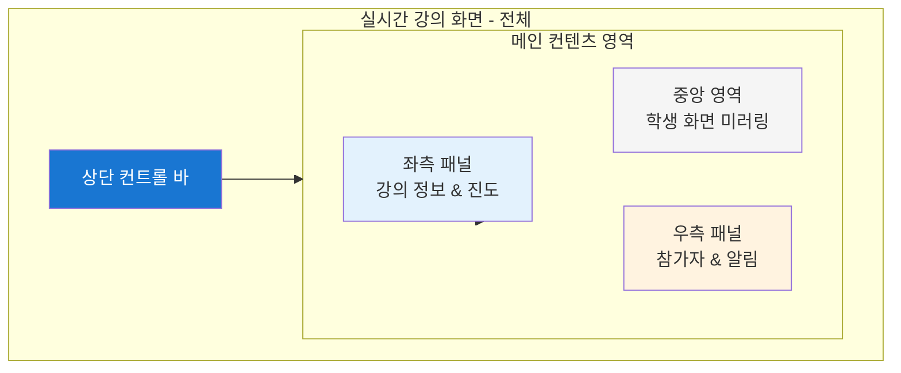
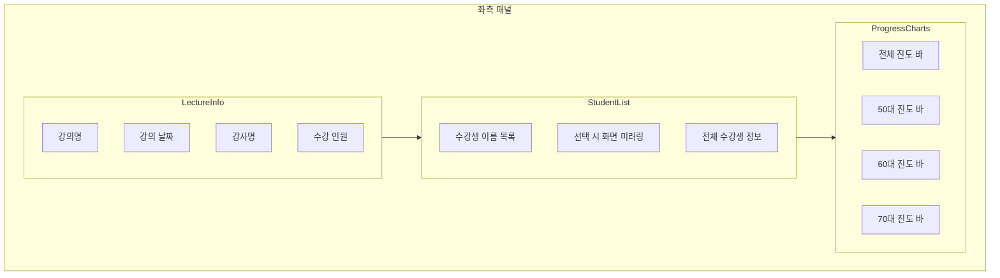
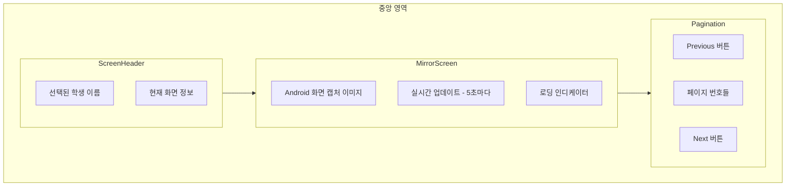
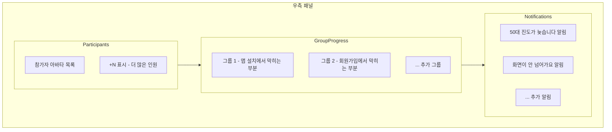
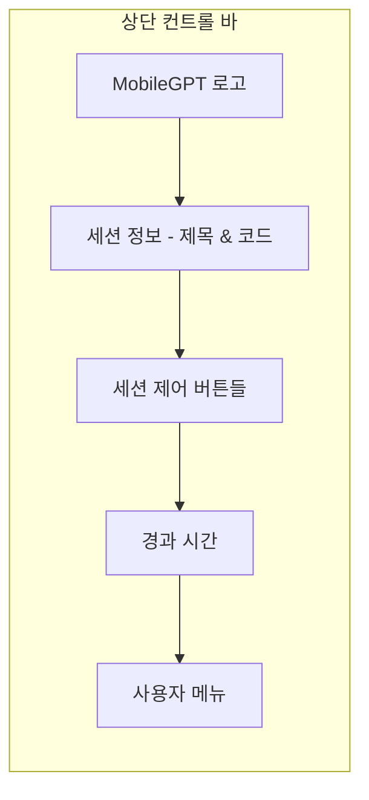
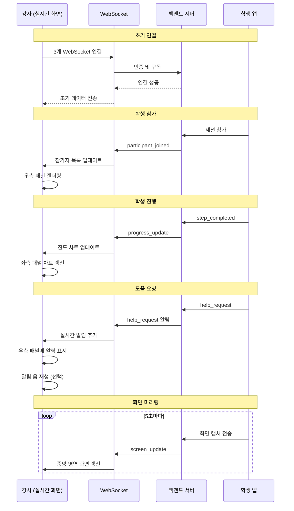

# 실시간 강의 화면 (Live Session Page)

강사가 세션 진행 중 사용하는 통합 실시간 강의 화면 UI 설계 문서입니다. Zoom 스타일의 단일 화면에서 세션 제어, 학생 모니터링, 도움 요청 처리를 동시에 수행할 수 있도록 구성됩니다.

## 목차
1. [개요](#개요)
2. [전체 화면 레이아웃](#전체-화면-레이아웃)
3. [좌측 패널 - 강의 정보 & 진도 현황](#좌측-패널---강의-정보--진도-현황)
4. [중앙 영역 - 학생 화면 미러링](#중앙-영역---학생-화면-미러링)
5. [우측 패널 - 참가자 & 알림](#우측-패널---참가자--알림)
6. [상단 컨트롤 바](#상단-컨트롤-바)
7. [세션 시작 플로우](#세션-시작-플로우)
8. [실시간 업데이트](#실시간-업데이트)

---

## 개요

### 페이지 정보
- **Route**: `/live-session/:sessionId`
- **권한**: INSTRUCTOR
- **용도**: 세션 진행 중 학생 실시간 모니터링 및 제어
- **특징**: 단일 화면 통합 대시보드

### 핵심 기능
1. **세션 제어**: 시작/일시정지/재개/다음 단계/종료
2. **학생 화면 모니터링**: 선택한 학생의 실제 화면 미러링
3. **참가자 현황**: 실시간 참가자 목록 및 상태
4. **진도 추적**: 연령대별/전체 진도 차트
5. **도움 요청 처리**: 실시간 알림 및 즉시 대응
6. **그룹별 학습 내용**: 각 그룹의 현재 학습 단계

---

## 전체 화면 레이아웃

### 레이아웃 구조 (3-Column Layout)



### 화면 비율

```
┌─────────────────────────────────────────────────────────────┐
│  상단 컨트롤 바 (64px 고정)                                    │
├──────────┬────────────────────────────────┬──────────────────┤
│          │                                │                  │
│  좌측    │        중앙 영역                │     우측         │
│  패널    │     (학생 화면)                 │     패널         │
│          │                                │                  │
│  20%     │         60%                    │      20%         │
│          │                                │                  │
│  고정    │      가변 (flex-grow)          │     고정         │
│  280px   │                                │     320px        │
│          │                                │                  │
│          │                                │                  │
│          │                                │                  │
└──────────┴────────────────────────────────┴──────────────────┘
```

---

## 좌측 패널 - 강의 정보 & 진도 현황

### 구성 요소



### 1. 강의 정보 섹션

```typescript
interface LectureInfo {
  lectureName: string;      // 예: "김OO"
  lectureDate: string;      // 예: "2025-10-10"
  instructor: string;       // 예: "강OO"
  totalStudents: number;    // 예: 68명
}
```

**UI 디자인**:
```
┌──────────────────────────┐
│  강의 정보                │
├──────────────────────────┤
│  강의명: 김OO            │
│  강의 날짜: 2025-10-10   │
│  강사명: 강OO            │
│  수강 인원: 68명         │
└──────────────────────────┘
```

- **폰트**: Body 1 (16px), Medium
- **간격**: 각 항목 8px
- **배경**: White (#FFFFFF)
- **패딩**: 16px

---

### 2. 수강생 목록

```typescript
interface Student {
  id: number;
  name: string;
  avatarUrl?: string;
  isSelected: boolean;     // 현재 화면에 표시 중인지
  status: 'active' | 'inactive' | 'help_needed';
}
```

**UI 디자인**:
```
┌──────────────────────────┐
│  수강생 이름              │
├──────────────────────────┤
│  [👤] 김명희              │  ← 선택됨 (파란 배경)
│  [ ] 이철수               │
│  [ ] 박순자               │
│  [ ] ...                  │
│                           │
│  전체 수강생의 정보       │  ← 링크
└──────────────────────────┘
```

- **항목 높이**: 48px
- **선택 표시**: 파란 배경 (#E3F2FD)
- **호버**: 연한 회색 (#F5F5F5)
- **상태 아이콘**:
  - Active: 초록 점 (●)
  - Inactive: 회색 점 (●)
  - Help Needed: 빨간 점 + 🆘 아이콘

**인터랙션**:
- 클릭 시 → 중앙 영역에 해당 학생 화면 표시
- "전체 수강생의 정보" 클릭 → 상세 모달 또는 별도 페이지

---

### 3. 진도 차트

```typescript
interface ProgressData {
  label: string;           // "전체 진도", "50대 진도" 등
  current: number;         // 현재 완료 학생 수
  total: number;           // 전체 학생 수
  percentage: number;      // 0-100
  color: string;          // 차트 색상
}
```

**UI 디자인**:
```
┌──────────────────────────┐
│  전체 진도                │
│  ████████████░░░░  75%   │
│                           │
│  50대 진도                │
│  ████████░░░░░░░░  50%   │
│                           │
│  60대 진도                │
│  ████████████████  95%   │
│                           │
│  70대 진도                │
│  ██████████░░░░░░  60%   │
└──────────────────────────┘
```

**색상 매핑**:
- 전체: Primary Blue (#1976D2)
- 50대: Cyan (#00BCD4)
- 60대: Pink (#E91E63)
- 70대: Green (#4CAF50)

**Progress Bar 스타일**:
- 높이: 24px
- Border Radius: 12px
- 배경: #E0E0E0
- Fill: 각 연령대 색상
- 레이블: 우측에 퍼센트 표시

---

## 중앙 영역 - 학생 화면 미러링

### 목적
선택한 학생의 실제 Android 화면을 실시간으로 표시하여 강사가 학생의 진행 상황을 시각적으로 확인

### UI 구성



### 화면 헤더

```
┌────────────────────────────────────────┐
│  김명희 님의 화면                       │
│  현재 세션에 참가한 시니어 목록         │
└────────────────────────────────────────┘
```

- **폰트**: H4 (20px), Semi-Bold
- **배경**: White
- **패딩**: 16px
- **Border-Bottom**: 1px solid #E0E0E0

---

### 학생 화면 미러링 영역

```
┌────────────────────────────────────────┐
│                                        │
│                                        │
│                                        │
│         [학생 Android 화면]            │
│            (9:16 비율)                 │
│                                        │
│                                        │
│                                        │
│                                        │
└────────────────────────────────────────┘
```

**기술 구현**:
- **방법 1**: AccessibilityService가 주기적으로 스크린샷 전송
- **방법 2**: WebSocket으로 화면 데이터 스트리밍
- **업데이트 주기**: 5초마다 (조정 가능)

**스타일**:
- 배경: #F5F5F5 (화면 외부)
- 화면 비율: 9:16 (모바일 세로)
- Max Width: 480px
- Border: 2px solid #E0E0E0
- Border Radius: 16px (모바일 디바이스 모양)
- Box Shadow: 0 4px 8px rgba(0,0,0,0.1)

**상태별 표시**:

1. **로딩 중**:
   ```
   ┌────────────────┐
   │                │
   │   ⏳ 로딩 중   │
   │                │
   └────────────────┘
   ```

2. **학생 미선택**:
   ```
   ┌────────────────┐
   │                │
   │ 👈 왼쪽에서    │
   │ 학생을 선택하세요│
   │                │
   └────────────────┘
   ```

3. **화면 없음**:
   ```
   ┌────────────────┐
   │                │
   │ 📱 화면 데이터 │
   │    없음        │
   │                │
   └────────────────┘
   ```

---

### 페이지네이션

여러 학생의 화면을 빠르게 전환할 수 있도록 페이지네이션 제공

```
┌────────────────────────────────────────┐
│  ← Previous  [1] 2 3 ... 67 68  Next → │
└────────────────────────────────────────┘
```

- 현재 페이지: Primary Color, Bold
- 다른 페이지: 클릭 가능, 호버 시 배경 변경
- Previous/Next: 화살표 + 텍스트

**동작**:
- 클릭 시 해당 학생으로 화면 전환
- 좌측 수강생 목록도 동기화

---

## 우측 패널 - 참가자 & 알림

### 구성 요소



---

### 1. 참가자 현황

```typescript
interface Participant {
  id: number;
  name: string;
  avatarUrl?: string;
  isOnline: boolean;
}
```

**UI 디자인**:
```
┌──────────────────────────┐
│  [👤][👤][👤] +1         │  ← 아바타 최대 3개 표시
└──────────────────────────┘
```

- **아바타 크기**: 48px × 48px
- **Border**: 2px solid white
- **Overlap**: -8px (겹침 효과)
- **+N 표시**: 4명 이상일 때 표시
- **온라인 상태**: 아바타 우하단에 초록 점

---

### 2. 그룹별 학습 내용

```typescript
interface GroupProgress {
  groupId: number;
  groupName: string;          // "그룹 1", "그룹 2"
  currentTask: string;        // "앱 설치에서 막히는 부분"
  participants: Participant[];
}
```

**UI 디자인**:
```
┌──────────────────────────┐
│  그룹 1 - 앱 설치에서    │
│           막히는 부분     │
│  [👤][👤][👤] +1         │
├──────────────────────────┤
│  그룹 2 - 회원가입에서   │
│           막히는 부분     │
│  [👤][👤][👤] +1         │
└──────────────────────────┘
```

**스타일**:
- 각 그룹: Card 형태
- 배경: White (#FFFFFF)
- Border: 1px solid #E0E0E0
- Border Radius: 8px
- Padding: 12px
- Margin: 8px (그룹 간)

**그룹 제목**:
- 폰트: Body 1 (16px), Semi-Bold
- 색상: Text Primary (#212121)

**현재 학습 내용**:
- 폰트: Body 2 (14px), Regular
- 색상: Text Secondary (#757575)

---

### 3. 실시간 알림 (도움 요청)

```typescript
interface Notification {
  id: number;
  type: 'help_request' | 'progress_alert' | 'system';
  title: string;
  message: string;
  timestamp: string;
  student?: Student;
  isResolved: boolean;
}
```

**UI 디자인**:
```
┌──────────────────────────┐
│  ⓘ 50대 진도가 늦습니다  │
│     (시스템) - 30초 전    │
│     [확인]               │
├──────────────────────────┤
│  🆘 화면이 안 넘어가요   │
│     1분 전                │
│     [확인]               │
└──────────────────────────┘
```

**알림 타입별 스타일**:

| 타입 | 아이콘 | 배경색 | 텍스트 색 |
|------|--------|--------|-----------|
| help_request | 🆘 | #FFEBEE (연한 빨강) | #D32F2F (빨강) |
| progress_alert | ⚠️ | #FFF3E0 (연한 주황) | #F57C00 (주황) |
| system | ⓘ | #E3F2FD (연한 파랑) | #1976D2 (파랑) |

**알림 카드 스타일**:
- Border Radius: 8px
- Padding: 12px
- Margin: 8px (알림 간)
- Box Shadow: 0 2px 4px rgba(0,0,0,0.1)

**인터랙션**:
- **확인 버튼**: 알림 해결 처리 → 목록에서 제거
- **닫기 버튼 (×)**: 우상단에 표시, 알림 숨기기
- **클릭**: 알림 상세 정보 표시 (선택)

**자동 갱신**:
- WebSocket으로 실시간 수신
- 새 알림 시 애니메이션 효과 (슬라이드 인)

---

## 상단 컨트롤 바

### 구성 요소



**레이아웃**:
```
┌──────────────────────────────────────────────────────────────┐
│ 🏠 │ 세션: 김OO 강의 (코드: 123456) │ [시작][일시정지][다음][종료] │ ⏱ 00:15:30 │ 👤│
└──────────────────────────────────────────────────────────────┘
```

---

### 1. 세션 정보

```typescript
interface SessionInfo {
  title: string;          // "김OO 강의"
  code: string;           // "123456"
  status: 'CREATED' | 'ACTIVE' | 'PAUSED' | 'ENDED';
}
```

**표시**:
```
세션: 김OO 강의 (코드: 123456)
```

- 폰트: Body 1 (16px), Medium
- 색상: White (#FFFFFF)
- 코드: Monospace 폰트

---

### 2. 세션 제어 버튼

```typescript
type SessionControl = 'start' | 'pause' | 'resume' | 'next' | 'end';
```

**버튼 목록**:

| 버튼 | 표시 조건 | 색상 | 아이콘 |
|------|-----------|------|--------|
| 시작 | status = CREATED | Primary (#1976D2) | ▶️ |
| 일시정지 | status = ACTIVE | Warning (#FF9800) | ⏸️ |
| 재개 | status = PAUSED | Primary (#1976D2) | ▶️ |
| 다음 단계 | status = ACTIVE | Info (#2196F3) | ⏭️ |
| 종료 | status = ACTIVE or PAUSED | Error (#F44336) | ⏹️ |

**버튼 스타일**:
- Height: 40px
- Padding: 8px 16px
- Border Radius: 8px
- Font: 14px, Semi-Bold
- Margin: 0 4px

**버튼 동작**:
1. **시작**: POST `/api/sessions/{id}/start/` → 모든 학생에게 알림
2. **일시정지**: POST `/api/sessions/{id}/pause/` → 학생 화면 일시정지
3. **재개**: POST `/api/sessions/{id}/resume/` → 학습 재개
4. **다음 단계**: POST `/api/sessions/{id}/next-step/` → 다음 Subtask 진행
5. **종료**: 확인 다이얼로그 → POST `/api/sessions/{id}/end/`

---

### 3. 경과 시간

```typescript
interface SessionTimer {
  startTime: string;      // ISO 8601
  elapsedSeconds: number;
}
```

**표시 형식**:
```
⏱ 00:15:30
```

- 형식: HH:MM:SS
- 색상: White (#FFFFFF)
- 폰트: Monospace, 18px
- 1초마다 자동 갱신

---

### 4. 사용자 메뉴

```
[👤 ▼]
```

**드롭다운 메뉴**:
- 프로필
- 설정
- 로그아웃

---

## 세션 시작 플로우

### 세션 생성 → 실시간 화면 진입

```mermaid
flowchart TD
    Start([대시보드 홈]) --> SelectLecture[강의 선택]
    SelectLecture --> CreateSession[세션 생성]
    CreateSession --> ShowCode[세션 코드 표시 모달]

    ShowCode --> CopyCode{코드 복사?}
    CopyCode -->|Yes| Copied[클립보드에 복사]
    CopyCode -->|No| ShareManual[수동으로 공유]

    Copied --> ShareStudents[학생들에게 코드 공유]
    ShareManual --> ShareStudents

    ShareStudents --> EnterLive[실시간 화면 진입 버튼]
    EnterLive --> LiveSession[/live-session/{sessionId}]

    LiveSession --> WaitStudents[학생 참가 대기]
    WaitStudents --> StudentsJoin{학생 참가?}

    StudentsJoin -->|Yes| UpdateList[참가자 목록 업데이트]
    StudentsJoin -->|계속 대기| WaitStudents

    UpdateList --> ReadyToStart{모두 참가?}
    ReadyToStart -->|Yes| ClickStart[시작 버튼 클릭]
    ReadyToStart -->|No| WaitStudents

    ClickStart --> SessionActive[세션 활성화]
    SessionActive --> MonitorStudents[실시간 모니터링 시작]

    style LiveSession fill:#4CAF50
    style SessionActive fill:#4CAF50
```

---

### 세션 코드 공유 모달

세션 생성 직후 표시되는 모달:

```
┌────────────────────────────────────┐
│  세션 코드가 생성되었습니다!       │
│                                    │
│        123456                      │
│     (큰 글씨, 복사 가능)           │
│                                    │
│  [코드 복사]  [실시간 화면 진입]  │
└────────────────────────────────────┘
```

**인터랙션**:
- **코드 복사**: 클립보드에 복사 + "복사됨" 알림
- **실시간 화면 진입**: `/live-session/{sessionId}` 페이지로 이동

---

## 실시간 업데이트

### WebSocket 연결

실시간 화면은 **3개의 WebSocket 연결**을 사용합니다:

#### 1. 세션 제어 WebSocket
```
ws://server/ws/sessions/{sessionCode}/
```

**수신 메시지**:
- `participant_joined`: 새 학생 참가
- `participant_left`: 학생 퇴장
- `session_status_change`: 세션 상태 변경

---

#### 2. 대시보드 모니터링 WebSocket
```
ws://server/ws/dashboard/lectures/{lectureId}/
```

**수신 메시지**:
- `progress_update`: 학생 진행 상황 업데이트
- `help_request`: 도움 요청 알림

---

#### 3. 화면 미러링 WebSocket (선택)
```
ws://server/ws/screen-mirror/{studentId}/
```

**수신 메시지**:
- `screen_update`: 학생 화면 이미지 데이터 (Base64)

---

### 업데이트 주기

| 항목 | 업데이트 방식 | 주기 |
|------|---------------|------|
| 참가자 목록 | WebSocket | 실시간 |
| 학생 화면 | WebSocket or Polling | 5초 |
| 진도 차트 | WebSocket | 실시간 (변경 시) |
| 도움 요청 | WebSocket | 실시간 |
| 경과 시간 | 클라이언트 타이머 | 1초 |

---

### 실시간 업데이트 시퀀스



---

## 반응형 디자인

### 화면 크기별 레이아웃

#### 대형 화면 (1920px 이상)
```
[좌측 280px] [중앙 flex-grow] [우측 320px]
```

#### 중형 화면 (1280px - 1920px)
```
[좌측 240px] [중앙 flex-grow] [우측 280px]
```

#### 소형 화면 (1280px 미만)
- 좌측/우측 패널을 탭으로 전환
- 중앙 영역만 기본 표시
- 하단에 탭 바 추가: [강의 정보] [참가자] [알림]

---

## 접근성

### 키보드 단축키

| 단축키 | 기능 |
|--------|------|
| `Space` | 세션 시작/일시정지 |
| `→` | 다음 학생 화면 |
| `←` | 이전 학생 화면 |
| `N` | 다음 단계 |
| `Esc` | 종료 확인 다이얼로그 |

### 스크린 리더
- 모든 버튼에 `aria-label` 제공
- 알림에 `role="alert"` 추가
- 진도 차트에 텍스트 설명 제공

---

## 성능 최적화

### 1. 화면 미러링 최적화
- 이미지 압축: JPEG 품질 80%
- 해상도 제한: 최대 720p
- 캐싱: 마지막 화면 캐시하여 로딩 시간 단축

### 2. 목록 렌더링 최적화
- Virtual Scrolling: 수강생 목록 100명 이상 시
- React.memo: 불필요한 리렌더링 방지

### 3. WebSocket 메시지 최적화
- 메시지 배칭: 1초에 여러 업데이트 묶어서 처리
- 쓰로틀링: 동일 메시지 0.5초 내 중복 무시

---

## 에러 처리

### WebSocket 연결 실패

```
┌────────────────────────────────┐
│  ⚠️ 실시간 연결이 끊겼습니다  │
│                                │
│  [재연결 시도]  [새로고침]    │
└────────────────────────────────┘
```

### 학생 화면 로딩 실패

```
┌────────────────────────────────┐
│  📱 화면을 불러올 수 없습니다 │
│                                │
│  • 학생이 비활성 상태일 수 있습니다 │
│  • AccessibilityService가 꺼져있을 수 있습니다 │
│                                │
│  [다시 시도]                   │
└────────────────────────────────┘
```

---

## 변경 이력

| 버전 | 날짜 | 변경 내용 |
|------|------|-----------|
| 1.0  | 2025-11-14 | 초안 작성 (Zoom 스타일 통합 화면) |

---

## 참고 자료

- [09_web_dashboard_user_flow.md](./09_web_dashboard_user_flow.md) - 기존 웹 대시보드 플로우
- [14_websocket_protocol.md](./14_websocket_protocol.md) - WebSocket 프로토콜
- [07_ui_design_system.md](./07_ui_design_system.md) - UI 디자인 시스템
- Zoom 웹 클라이언트 UI 참고
