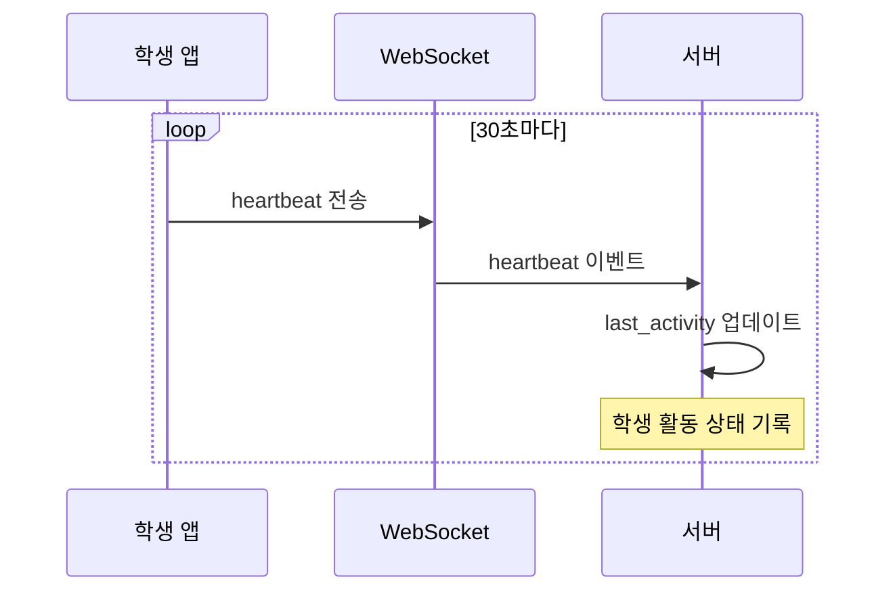
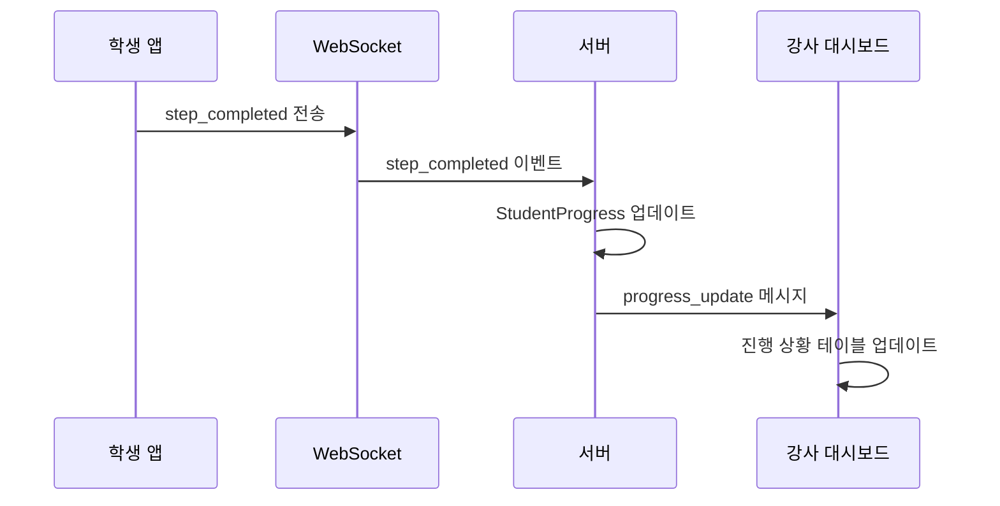
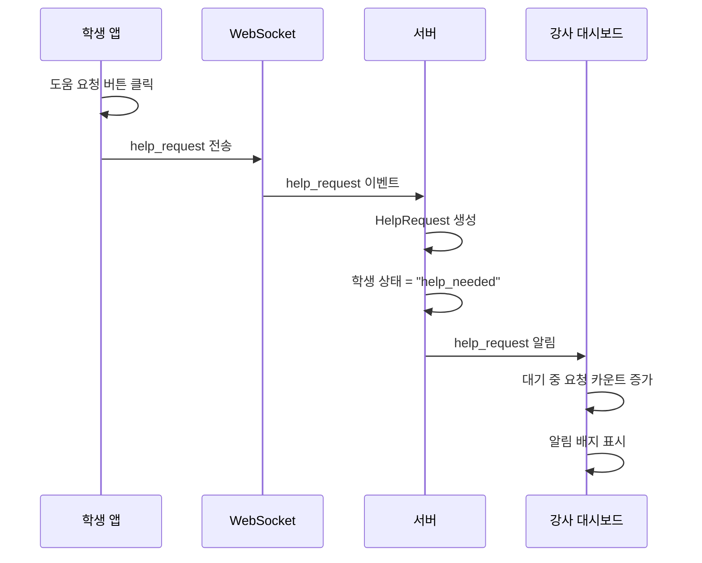
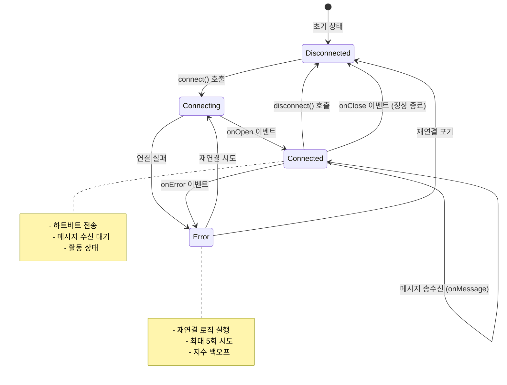
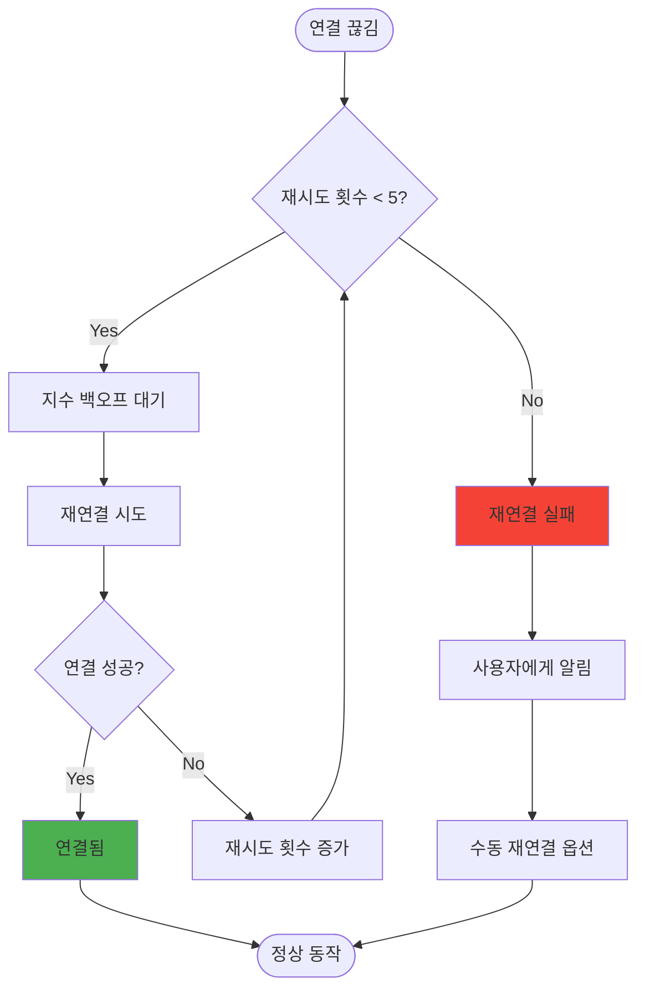
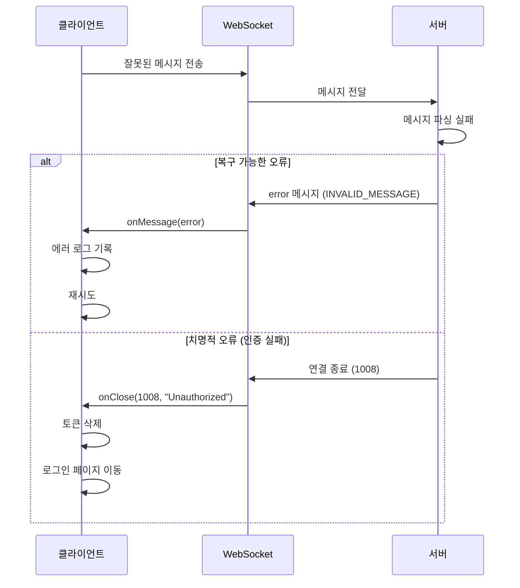
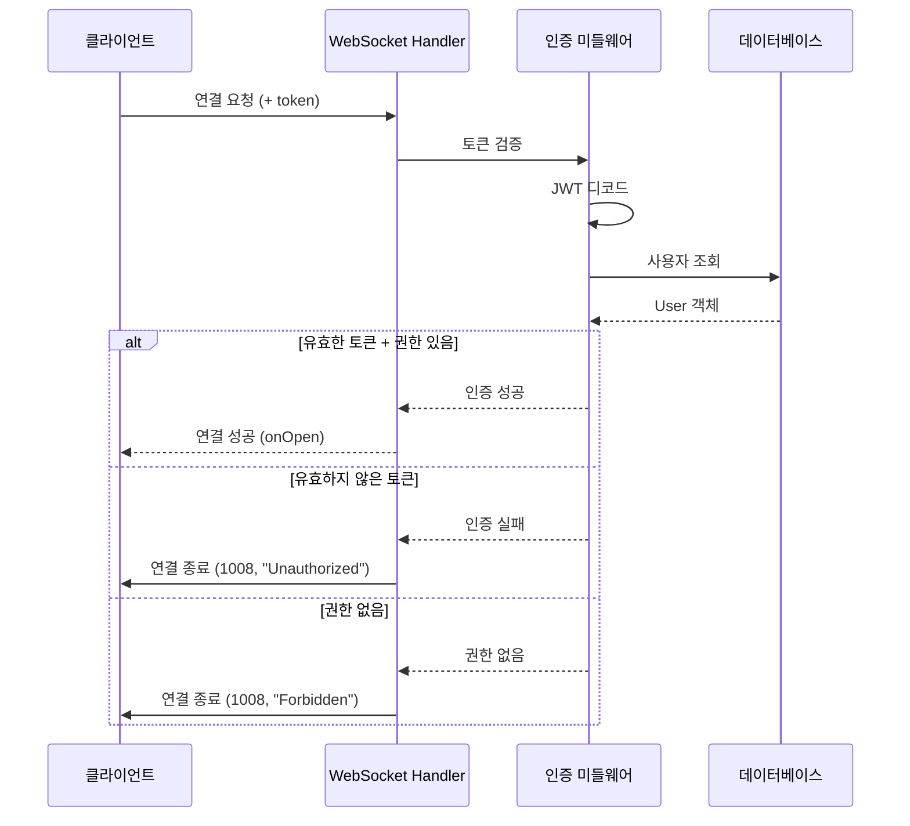
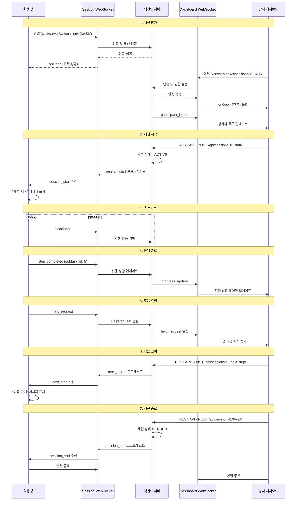

# WebSocket 메시지 프로토콜

MobileGPT 프로젝트의 WebSocket 실시간 통신 프로토콜 명세입니다. 학생 앱, 강사 대시보드, 백엔드 서버 간의 메시지 포맷과 통신 규칙을 정의합니다.

## 목차
1. [개요](#개요)
2. [연결 엔드포인트](#연결-엔드포인트)
3. [메시지 포맷](#메시지-포맷)
4. [학생 앱 메시지](#학생-앱-메시지)
5. [강사 대시보드 메시지](#강사-대시보드-메시지)
6. [서버 브로드캐스트 메시지](#서버-브로드캐스트-메시지)
7. [연결 관리](#연결-관리)
8. [에러 처리](#에러-처리)
9. [보안](#보안)

---

## 개요

### WebSocket 사용 목적
- **실시간 세션 제어**: 강사가 세션 시작/일시정지/재개/종료/다음 단계를 즉시 학생에게 전달
- **실시간 진행 상황**: 학생의 학습 진행 상황을 강사 대시보드에 실시간 반영
- **도움 요청**: 학생의 도움 요청을 즉시 강사에게 알림
- **활동 모니터링**: 학생의 하트비트로 활동 상태 추적

### 기술 스택
- **프로토콜**: WebSocket (RFC 6455)
- **백엔드**: Django Channels + Daphne ASGI Server
- **메시지 포맷**: JSON
- **인증**: JWT Token (Connection URL 또는 초기 메시지)

### WebSocket vs HTTP
| 특징 | HTTP | WebSocket |
|------|------|-----------|
| 연결 | 요청당 1회 | 지속적 연결 |
| 데이터 흐름 | 클라이언트 → 서버 | 양방향 |
| 오버헤드 | 높음 (헤더 반복) | 낮음 (최초 1회) |
| 실시간성 | 폴링 필요 | 즉시 전달 |
| 사용 사례 | REST API | 실시간 업데이트 |

---

## 연결 엔드포인트

### 1. 세션 WebSocket (학생 앱용)

```
ws://<server_host>/ws/session/<session_code>/
```

**용도**: 학생이 세션에 참가하여 강사로부터 실시간 메시지 수신 및 이벤트 전송

**파라미터**:
- `session_code`: 6자리 세션 코드 (예: `123456`)

**인증**:
- URL 쿼리 파라미터: `?token=<jwt_token>`
- 또는 연결 후 첫 메시지로 인증

**예시**:
```
ws://localhost:8000/ws/session/123456/?token=eyJhbGciOiJIUzI1NiIsInR5...
```

---

### 2. 세션 제어 WebSocket (강사 대시보드용)

```
ws://<server_host>/ws/sessions/<session_code>/
```

**용도**: 강사가 세션 상태 및 참가자 실시간 업데이트 수신

**파라미터**:
- `session_code`: 6자리 세션 코드

**인증**:
- URL 쿼리 파라미터: `?token=<jwt_token>`
- Role 확인: `INSTRUCTOR`만 허용

**예시**:
```
ws://localhost:8000/ws/sessions/123456/?token=eyJhbGciOiJIUzI1NiIsInR5...
```

---

### 3. 대시보드 모니터링 WebSocket (강사 대시보드용)

```
ws://<server_host>/ws/dashboard/lectures/<lecture_id>/
```

**용도**: 강의별 학생 진행 상황 실시간 모니터링

**파라미터**:
- `lecture_id`: 강의 ID (정수)

**인증**:
- URL 쿼리 파라미터: `?token=<jwt_token>`
- Role 확인: `INSTRUCTOR`만 허용

**예시**:
```
ws://localhost:8000/ws/dashboard/lectures/4/?token=eyJhbGciOiJIUzI1NiIsInR5...
```

---

## 메시지 포맷

### 기본 구조

모든 WebSocket 메시지는 JSON 포맷을 따르며, 다음 기본 구조를 갖습니다:

```typescript
interface BaseMessage {
  type: string;           // 메시지 타입 (필수)
  timestamp: string;      // ISO 8601 타임스탬프 (필수)
  data?: any;            // 메시지별 추가 데이터 (선택)
}
```

### 메시지 타입 분류

#### 학생 앱 → 서버 (Client to Server)
- `heartbeat`: 활동 상태 전송
- `step_completed`: 단계 완료 알림
- `help_request`: 도움 요청

#### 서버 → 학생 앱 (Server to Client)
- `session_start`: 세션 시작 알림
- `session_pause`: 세션 일시정지
- `session_resume`: 세션 재개
- `session_end`: 세션 종료
- `next_step`: 다음 단계 진행
- `notification`: 일반 알림

#### 서버 → 강사 대시보드 (Server to Instructor)
- `progress_update`: 학생 진행 상황 업데이트
- `help_request`: 도움 요청 알림
- `participant_joined`: 참가자 추가
- `participant_left`: 참가자 퇴장
- `session_status_change`: 세션 상태 변경

---

## 학생 앱 메시지

### 1. heartbeat (하트비트)

**방향**: 학생 앱 → 서버

**목적**: 학생이 활동 중임을 주기적으로 알림 (30초마다)

**포맷**:
```json
{
  "type": "heartbeat",
  "timestamp": "2025-11-14T12:00:00Z"
}
```

**서버 동작**:
1. 학생의 `last_activity` 필드 업데이트
2. 세션 참가 상태 유지
3. 로그 기록 (선택사항)

**시퀀스 다이어그램**:


---

### 2. step_completed (단계 완료)

**방향**: 학생 앱 → 서버

**목적**: 학생이 현재 단계(Subtask)를 완료했음을 알림

**포맷**:
```json
{
  "type": "step_completed",
  "timestamp": "2025-11-14T12:05:00Z",
  "data": {
    "subtask_id": 5,
    "completed_at": "2025-11-14T12:05:00Z"
  }
}
```

**필드 설명**:
- `subtask_id`: 완료한 Subtask의 ID (정수)
- `completed_at`: 완료 시간 (ISO 8601)

**서버 동작**:
1. `StudentProgress` 업데이트 (current_subtask, progress 증가)
2. 강사 대시보드에 `progress_update` 메시지 전송
3. 로그 기록

**시퀀스 다이어그램**:


---

### 3. help_request (도움 요청)

**방향**: 학생 앱 → 서버

**목적**: 학생이 수동으로 도움을 요청

**포맷**:
```json
{
  "type": "help_request",
  "timestamp": "2025-11-14T12:10:00Z",
  "data": {
    "message": "이 단계가 너무 어렵습니다",
    "subtask_id": 5
  }
}
```

**필드 설명**:
- `message`: 요청 메시지 (선택, 최대 500자)
- `subtask_id`: 현재 단계 ID (선택)

**서버 동작**:
1. `HelpRequest` 생성 (type=MANUAL, is_resolved=False)
2. 강사 대시보드에 `help_request` 메시지 전송
3. 학생 상태를 "help_needed"로 변경
4. 알림 전송 (선택)

**시퀀스 다이어그램**:


---

## 강사 대시보드 메시지

강사 대시보드는 주로 **수신 전용**이며, 세션 제어 API는 REST API를 통해 처리합니다.

### 수신 메시지

#### 1. progress_update (진행 상황 업데이트)

**방향**: 서버 → 강사 대시보드

**목적**: 학생의 학습 진행 상황 실시간 업데이트

**포맷**:
```json
{
  "type": "progress_update",
  "timestamp": "2025-11-14T12:05:00Z",
  "data": {
    "student_id": 3,
    "student_name": "학생3",
    "current_step": "Task 1 - Subtask 2",
    "progress": 45,
    "status": "in_progress",
    "last_activity": "2025-11-14T12:05:00Z"
  }
}
```

**필드 설명**:
- `student_id`: 학생 ID
- `student_name`: 학생 이름
- `current_step`: 현재 진행 중인 단계 이름
- `progress`: 진행률 (0-100)
- `status`: 상태 (`completed`, `in_progress`, `not_started`, `help_needed`)
- `last_activity`: 마지막 활동 시간

---

#### 2. help_request (도움 요청 알림)

**방향**: 서버 → 강사 대시보드

**목적**: 학생의 도움 요청을 강사에게 즉시 알림

**포맷**:
```json
{
  "type": "help_request",
  "timestamp": "2025-11-14T12:10:00Z",
  "data": {
    "request_id": 12,
    "student_id": 3,
    "student_name": "학생3",
    "student_email": "student3@test.com",
    "request_type": "MANUAL",
    "message": "이 단계가 너무 어렵습니다",
    "subtask_id": 5,
    "subtask_name": "Task 1 - Subtask 2"
  }
}
```

**필드 설명**:
- `request_id`: 도움 요청 ID
- `request_type`: 요청 타입 (`MANUAL` 또는 `AUTO`)
- `message`: 요청 메시지 (MANUAL인 경우)
- `subtask_name`: 현재 단계 이름

---

#### 3. participant_joined (참가자 추가)

**방향**: 서버 → 강사 대시보드 (세션 제어 WebSocket)

**목적**: 새로운 학생이 세션에 참가했음을 알림

**포맷**:
```json
{
  "type": "participant_joined",
  "timestamp": "2025-11-14T11:55:00Z",
  "data": {
    "participant": {
      "id": 5,
      "name": "학생5",
      "email": "student5@test.com",
      "joined_at": "2025-11-14T11:55:00Z"
    }
  }
}
```

---

#### 4. session_status_change (세션 상태 변경)

**방향**: 서버 → 강사 대시보드 (세션 제어 WebSocket)

**목적**: 세션 상태 변경 알림 (예: 시작, 일시정지, 종료)

**포맷**:
```json
{
  "type": "session_status_change",
  "timestamp": "2025-11-14T12:00:00Z",
  "data": {
    "status": "ACTIVE",
    "previous_status": "CREATED"
  }
}
```

**status 값**:
- `CREATED`: 생성됨
- `ACTIVE`: 진행 중
- `PAUSED`: 일시정지
- `ENDED`: 종료됨

---

## 서버 브로드캐스트 메시지

서버가 학생 앱으로 전송하는 메시지입니다.

### 1. session_start (세션 시작)

**방향**: 서버 → 학생 앱

**목적**: 강사가 세션을 시작했음을 모든 학생에게 알림

**포맷**:
```json
{
  "type": "session_start",
  "timestamp": "2025-11-14T12:00:00Z",
  "data": {
    "session_id": 10,
    "message": "세션이 시작되었습니다. 학습을 시작하세요!"
  }
}
```

**학생 앱 동작**:
1. 알림 메시지 표시
2. UI 상태 업데이트 (세션 활성 상태)
3. 학습 시작 가능

---

### 2. session_pause (세션 일시정지)

**방향**: 서버 → 학생 앱

**목적**: 강사가 세션을 일시정지했음을 알림

**포맷**:
```json
{
  "type": "session_pause",
  "timestamp": "2025-11-14T12:15:00Z",
  "data": {
    "message": "세션이 일시 정지되었습니다. 잠시 기다려주세요."
  }
}
```

**학생 앱 동작**:
1. 일시정지 메시지 표시
2. 학습 액션 비활성화 (선택)
3. 대기 상태로 전환

---

### 3. session_resume (세션 재개)

**방향**: 서버 → 학생 앱

**목적**: 강사가 세션을 재개했음을 알림

**포맷**:
```json
{
  "type": "session_resume",
  "timestamp": "2025-11-14T12:20:00Z",
  "data": {
    "message": "세션이 재개되었습니다. 학습을 계속하세요!"
  }
}
```

**학생 앱 동작**:
1. 재개 메시지 표시
2. 학습 액션 다시 활성화
3. 학습 재개

---

### 4. session_end (세션 종료)

**방향**: 서버 → 학생 앱

**목적**: 강사가 세션을 종료했음을 알림

**포맷**:
```json
{
  "type": "session_end",
  "timestamp": "2025-11-14T13:00:00Z",
  "data": {
    "message": "세션이 종료되었습니다. 수고하셨습니다!",
    "summary": {
      "total_steps": 10,
      "completed_steps": 8,
      "duration_minutes": 60
    }
  }
}
```

**학생 앱 동작**:
1. 종료 메시지 표시
2. WebSocket 연결 해제
3. SessionCodeScreen으로 이동

---

### 5. next_step (다음 단계)

**방향**: 서버 → 학생 앱

**목적**: 강사가 다음 단계로 진행하도록 지시

**포맷**:
```json
{
  "type": "next_step",
  "timestamp": "2025-11-14T12:10:00Z",
  "data": {
    "message": "다음 단계로 진행하세요",
    "next_subtask": {
      "id": 6,
      "name": "Task 2 - Subtask 1",
      "description": "다음 단계 설명..."
    }
  }
}
```

**학생 앱 동작**:
1. 다음 단계 안내 메시지 표시
2. 현재 단계 정보 업데이트
3. 진행 가능

---

### 6. notification (일반 알림)

**방향**: 서버 → 학생 앱

**목적**: 강사가 보내는 일반 알림 메시지

**포맷**:
```json
{
  "type": "notification",
  "timestamp": "2025-11-14T12:25:00Z",
  "data": {
    "message": "모두 잘 따라오고 있습니다. 좋아요!",
    "severity": "info"
  }
}
```

**severity 값**:
- `info`: 정보 (파란색)
- `success`: 성공 (초록색)
- `warning`: 경고 (주황색)
- `error`: 오류 (빨간색)

---

## 연결 관리

### 연결 생명주기



---

### 연결 초기화

#### 클라이언트 측 (TypeScript 예시)

```typescript
class WebSocketService {
  private ws: WebSocket | null = null;
  private reconnectAttempts = 0;
  private maxReconnectAttempts = 5;
  private reconnectDelay = 2000; // 2초

  connect(url: string, token: string) {
    const wsUrl = `${url}?token=${token}`;
    this.ws = new WebSocket(wsUrl);

    this.ws.onopen = this.handleOpen.bind(this);
    this.ws.onmessage = this.handleMessage.bind(this);
    this.ws.onerror = this.handleError.bind(this);
    this.ws.onclose = this.handleClose.bind(this);
  }

  private handleOpen(event: Event) {
    console.log('WebSocket connected');
    this.reconnectAttempts = 0; // 재연결 카운터 리셋
  }

  private handleMessage(event: MessageEvent) {
    try {
      const message = JSON.parse(event.data);
      this.processMessage(message);
    } catch (error) {
      console.error('Failed to parse message:', error);
    }
  }

  private handleError(event: Event) {
    console.error('WebSocket error:', event);
  }

  private handleClose(event: CloseEvent) {
    console.log('WebSocket closed:', event.code, event.reason);

    // 정상 종료가 아니면 재연결 시도
    if (event.code !== 1000 && this.reconnectAttempts < this.maxReconnectAttempts) {
      this.reconnect();
    }
  }

  private reconnect() {
    this.reconnectAttempts++;
    const delay = this.reconnectDelay * Math.pow(2, this.reconnectAttempts - 1); // 지수 백오프

    console.log(`Reconnecting... Attempt ${this.reconnectAttempts}`);
    setTimeout(() => {
      this.connect(this.url, this.token);
    }, delay);
  }

  send(message: any) {
    if (this.ws && this.ws.readyState === WebSocket.OPEN) {
      this.ws.send(JSON.stringify(message));
    } else {
      console.error('WebSocket is not open. Cannot send message.');
    }
  }

  disconnect() {
    if (this.ws) {
      this.ws.close(1000, 'Client disconnect');
      this.ws = null;
    }
  }
}
```

---

#### Android 측 (Kotlin 예시)

```kotlin
class WebSocketManager(
    private val url: String,
    private val token: String
) {
    private var webSocket: WebSocket? = null
    private val client = OkHttpClient()
    private var reconnectAttempts = 0
    private val maxReconnectAttempts = 5
    private val reconnectDelay = 2000L

    fun connect() {
        val request = Request.Builder()
            .url("$url?token=$token")
            .build()

        webSocket = client.newWebSocket(request, object : WebSocketListener() {
            override fun onOpen(webSocket: WebSocket, response: Response) {
                Log.d("WebSocket", "Connected")
                reconnectAttempts = 0
            }

            override fun onMessage(webSocket: WebSocket, text: String) {
                val message = Json.decodeFromString<WebSocketMessage>(text)
                processMessage(message)
            }

            override fun onFailure(webSocket: WebSocket, t: Throwable, response: Response?) {
                Log.e("WebSocket", "Error: ${t.message}")
                reconnect()
            }

            override fun onClosed(webSocket: WebSocket, code: Int, reason: String) {
                Log.d("WebSocket", "Closed: $code - $reason")
                if (code != 1000 && reconnectAttempts < maxReconnectAttempts) {
                    reconnect()
                }
            }
        })
    }

    private fun reconnect() {
        reconnectAttempts++
        val delay = reconnectDelay * (1 shl (reconnectAttempts - 1)) // 지수 백오프

        Handler(Looper.getMainLooper()).postDelayed({
            connect()
        }, delay)
    }

    fun send(message: Any) {
        val json = Json.encodeToString(message)
        webSocket?.send(json)
    }

    fun disconnect() {
        webSocket?.close(1000, "Client disconnect")
        webSocket = null
    }
}
```

---

### 재연결 전략

#### 지수 백오프 (Exponential Backoff)

재연결 시도 간격을 지수적으로 증가시켜 서버 부하를 줄입니다.

| 시도 횟수 | 대기 시간 | 계산 |
|-----------|-----------|------|
| 1차 | 2초 | 2 × 2^0 = 2초 |
| 2차 | 4초 | 2 × 2^1 = 4초 |
| 3차 | 8초 | 2 × 2^2 = 8초 |
| 4차 | 16초 | 2 × 2^3 = 16초 |
| 5차 | 32초 | 2 × 2^4 = 32초 |

#### 재연결 플로우차트



---

### 하트비트 (Heartbeat)

#### 목적
- 연결 상태 유지
- 학생 활동 추적
- 비활성 연결 감지

#### 전송 간격
- **학생 앱**: 30초마다 자동 전송
- **강사 대시보드**: 필요 없음 (서버가 관리)

#### 타임아웃
- 서버가 60초 동안 하트비트를 받지 못하면 비활성 상태로 간주
- 90초 동안 받지 못하면 연결 종료

---

## 에러 처리

### WebSocket 종료 코드 (Close Codes)

| 코드 | 이름 | 설명 | 클라이언트 동작 |
|------|------|------|-----------------|
| 1000 | Normal Closure | 정상 종료 | 재연결 없음 |
| 1001 | Going Away | 서버 종료 | 재연결 시도 |
| 1006 | Abnormal Closure | 비정상 종료 | 재연결 시도 |
| 1008 | Policy Violation | 정책 위반 (인증 실패 등) | 재연결 없음, 로그인 페이지 이동 |
| 1011 | Internal Error | 서버 내부 오류 | 재연결 시도 |

### 에러 메시지 포맷

서버가 클라이언트에게 에러를 전송할 때 사용하는 포맷:

```json
{
  "type": "error",
  "timestamp": "2025-11-14T12:30:00Z",
  "data": {
    "code": "INVALID_MESSAGE",
    "message": "메시지 포맷이 올바르지 않습니다",
    "details": "Missing 'type' field"
  }
}
```

#### 에러 코드

| 코드 | 설명 | 복구 방법 |
|------|------|-----------|
| `INVALID_MESSAGE` | 메시지 포맷 오류 | 올바른 JSON 전송 |
| `UNAUTHORIZED` | 인증 실패 | 토큰 갱신 후 재연결 |
| `SESSION_NOT_FOUND` | 세션 없음 | 세션 코드 확인 |
| `SESSION_ENDED` | 세션 종료됨 | 새 세션 참가 |
| `RATE_LIMIT` | 요청 과다 | 전송 빈도 줄이기 |

### 에러 처리 시퀀스



---

## 보안

### 인증 (Authentication)

#### JWT Token 전송 방법

**1. URL 쿼리 파라미터 (권장)**
```
ws://server/ws/session/123456/?token=eyJhbGciOiJIUzI1NiIsInR5...
```

**장점**:
- 연결 시점에 즉시 인증
- 구현 간단

**단점**:
- URL에 토큰 노출 (로그에 기록될 수 있음)

**2. 초기 메시지로 전송 (대안)**
```json
{
  "type": "auth",
  "token": "eyJhbGciOiJIUzI1NiIsInR5..."
}
```

**장점**:
- URL에 토큰 노출 안 됨

**단점**:
- 연결 후 추가 인증 단계 필요

---

### 권한 검증 (Authorization)

#### 역할 기반 접근 제어

| 엔드포인트 | 허용 역할 | 검증 내용 |
|------------|-----------|-----------|
| `/ws/session/{code}/` | STUDENT | 세션 참가 권한 확인 |
| `/ws/sessions/{code}/` | INSTRUCTOR | 세션 소유자 확인 |
| `/ws/dashboard/lectures/{id}/` | INSTRUCTOR | 강의 소유자 확인 |

#### 검증 시퀀스



---

### 메시지 검증

#### 입력 검증 (Input Validation)

모든 수신 메시지는 다음 항목을 검증합니다:

1. **JSON 포맷**: 올바른 JSON인지 확인
2. **필수 필드**: `type`, `timestamp` 존재 여부
3. **타입 검증**: `type` 값이 허용된 값인지 확인
4. **데이터 검증**: `data` 필드의 스키마 검증
5. **크기 제한**: 메시지 크기 최대 10KB

#### 예시 (Django Channels Consumer)

```python
import json
from channels.generic.websocket import AsyncWebsocketConsumer

class SessionConsumer(AsyncWebsocketConsumer):
    async def receive(self, text_data):
        try:
            message = json.loads(text_data)
        except json.JSONDecodeError:
            await self.send_error("INVALID_MESSAGE", "Invalid JSON format")
            return

        # 필수 필드 검증
        if 'type' not in message or 'timestamp' not in message:
            await self.send_error("INVALID_MESSAGE", "Missing required fields")
            return

        # 타입 검증
        allowed_types = ['heartbeat', 'step_completed', 'help_request']
        if message['type'] not in allowed_types:
            await self.send_error("INVALID_MESSAGE", f"Unknown message type: {message['type']}")
            return

        # 메시지 처리
        await self.process_message(message)
```

---

### 속도 제한 (Rate Limiting)

#### 메시지 전송 제한

| 메시지 타입 | 제한 | 설명 |
|-------------|------|------|
| `heartbeat` | 1/30초 | 30초마다 1회 |
| `step_completed` | 10/분 | 분당 최대 10회 |
| `help_request` | 5/분 | 분당 최대 5회 |

#### 위반 시 동작

1. 경고 메시지 전송 (처음 2회)
2. 일시적 메시지 무시 (3-5회)
3. 연결 종료 (6회 이상)

---

### TLS/SSL 암호화

#### 프로덕션 환경

```
wss://<server_host>/ws/session/<session_code>/?token=...
```

- **프로토콜**: `wss://` (WebSocket Secure)
- **인증서**: Let's Encrypt 또는 상용 SSL 인증서
- **최소 TLS 버전**: TLS 1.2

---

## 메시지 시퀀스 예시

### 전체 세션 플로우



---

## 테스트 및 디버깅

### WebSocket 테스트 도구

1. **웹 기반**: [websocket.org Echo Test](https://www.websocket.org/echo.html)
2. **CLI**: `wscat` (npm install -g wscat)
   ```bash
   wscat -c "ws://localhost:8000/ws/session/123456/?token=..."
   ```
3. **Postman**: WebSocket 요청 지원

### 로깅

#### 클라이언트 로깅
```typescript
console.log('[WS] Connected');
console.log('[WS] Sent:', message);
console.log('[WS] Received:', message);
console.error('[WS] Error:', error);
```

#### 서버 로깅 (Django)
```python
import logging
logger = logging.getLogger(__name__)

logger.info(f"WebSocket connected: {self.scope['user']}")
logger.debug(f"Received message: {message}")
logger.error(f"Error processing message: {e}")
```

---

## 성능 고려사항

### 메시지 크기 최적화
- **최대 크기**: 10KB
- **압축**: 큰 메시지는 gzip 압축 (선택)
- **배칭**: 여러 업데이트를 하나의 메시지로 묶기

### 동시 연결 수
- **학생 앱**: 강의당 최대 100명
- **강사 대시보드**: 강의당 1-5명
- **서버 확장**: 필요 시 로드 밸런서 + Redis Pub/Sub

### 메시지 전송 빈도
- **하트비트**: 30초마다
- **진행 상황**: 변경 시마다 (쓰로틀링: 1초에 최대 1회)
- **도움 요청**: 즉시

---

## 변경 이력

| 버전 | 날짜 | 변경 내용 |
|------|------|-----------|
| 1.0  | 2025-11-14 | 초안 작성 |

---

## 참고 자료

- [WebSocket RFC 6455](https://datatracker.ietf.org/doc/html/rfc6455)
- [Django Channels Documentation](https://channels.readthedocs.io/)
- [Scarlet WebSocket Client (Kotlin)](https://github.com/Tinder/Scarlet)
- [08_android_user_flow.md](./08_android_user_flow.md) - Android 앱 화면 흐름
- [09_web_dashboard_user_flow.md](./09_web_dashboard_user_flow.md) - 웹 대시보드 화면 흐름
